* Table of Contents
{:toc}

--------------------------------------------------------------------------------------------------------------------

## **Acknowledgements**

* This project is based on the AddressBook-Level3 project created by the [SE-EDU initiative](https://se-education.org/).

--------------------------------------------------------------------------------------------------------------------

## **Setting up, getting started**

Refer to the guide [_Setting up and getting started_](SettingUp.md).

--------------------------------------------------------------------------------------------------------------------

## **Design**

:bulb: **Tip:** The `.puml` files used to create diagrams in this document `docs/diagrams` folder. Refer to the [_PlantUML Tutorial_ at se-edu/guides](https://se-education.org/guides/tutorials/plantUml.html) to learn how to create and edit diagrams.

### Architecture

The ***Architecture Diagram*** given above explains the high-level design of the App.

Given below is a quick overview of main components and how they interact with each other.

**Main components of the architecture**

**`Main`** (consisting of classes [`Main`](https://github.com/AY2324S2-CS2103T-W08-1/tp/blob/master/src/main/java/seedu/hirehub/Main.java) and [`MainApp`](https://github.com/AY2324S2-CS2103T-W08-1/tp/blob/master/src/main/java/seedu/hirehub/MainApp.java)) is in charge of the app launch and shut down.
* At app launch, it initializes the other components in the correct sequence, and connects them up with each other.
* At shut down, it shuts down the other components and invokes cleanup methods where necessary.

The bulk of the app's work is done by the following four components:

* [**`UI`**](#ui-component): The UI of the App.
* [**`Logic`**](#logic-component): The command executor.
* [**`Model`**](#model-component): Holds the data of the App in memory.
* [**`Storage`**](#storage-component): Reads data from, and writes data to, the hard disk.

[**`Commons`**](#common-classes) represents a collection of classes used by multiple other components.

**How the architecture components interact with each other**

The *Sequence Diagram* below shows how the components interact with each other for the scenario where the user issues the command `delete 1`.

Each of the four main components (also shown in the diagram above),

* defines its *API* in an `interface` with the same name as the Component.
* implements its functionality using a concrete `{Component Name}Manager` class (which follows the corresponding API `interface` mentioned in the previous point.

For example, the `Logic` component defines its API in the `Logic.java` interface and implements its functionality using the `LogicManager.java` class which follows the `Logic` interface. Other components interact with a given component through its interface rather than the concrete class (reason: to prevent outside component's being coupled to the implementation of a component), as illustrated in the (partial) class diagram below.

The sections below give more details of each component.

### UI component

The **API** of this component is specified in [`Ui.java`](https://github.com/AY2324S2-CS2103T-W08-1/tp/blob/master/src/main/java/seedu/hirehub/ui/Ui.java)

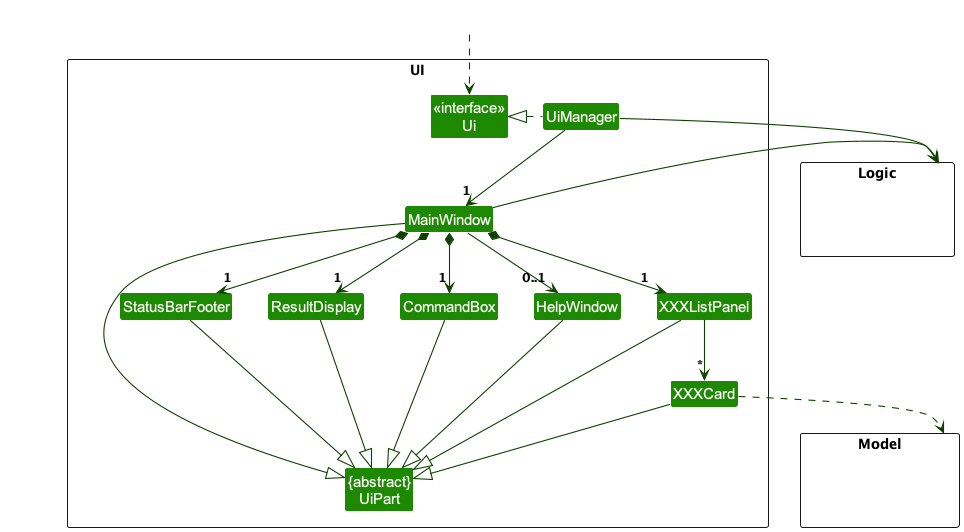

The UI consists of a `MainWindow` that is made up of parts e.g.`CommandBox`, `ResultDisplay`, `PersonListPanel`, `JobListPanel`, `StatusBarFooter` etc. All these, including the `MainWindow`, inherit from the abstract `UiPart` class which captures the commonalities between classes that represent parts of the visible GUI.

Each one of `Job`, `Application` and `Person` has an associated `ListPanel` and `Card`, as indicated with `XXXListPanel` and `XXXCard`.

The `UI` component uses the JavaFx UI framework. The layout of these UI parts are defined in matching `.fxml` files that are in the `src/main/resources/view` folder. For example, the layout of the [`MainWindow`](https://github.com/se-edu/addressbook-level3/tree/master/src/main/java/seedu/address/ui/MainWindow.java) is specified in [`MainWindow.fxml`](https://github.com/se-edu/addressbook-level3/tree/master/src/main/resources/view/MainWindow.fxml)

The `UI` component,

* executes user commands using the `Logic` component.
* listens for changes to `Model` data so that the UI can be updated with the modified data.
* keeps a reference to the `Logic` component, because the `UI` relies on the `Logic` to execute commands.
* depends on some classes in the `Model` component, as it displays `Person` object residing in the `Model`.

### Logic component

**API** : [`Logic.java`](https://github.com/AY2324S2-CS2103T-W08-1/tp/blob/master/src/main/java/seedu/hirehub/logic/Logic.java)

Here's a (partial) class diagram of the `Logic` component:

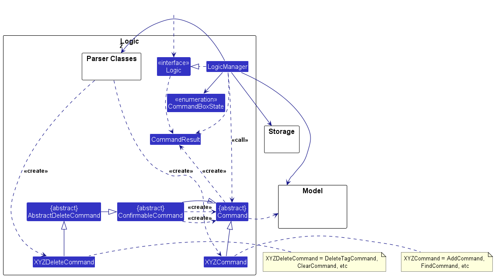

The sequence diagram below illustrates the interactions within the `Logic` component, taking `execute("delete 1")` API call as an example.

:information_source: **Note:** The lifeline for `DeleteCommandParser` should end at the destroy marker (X) but due to a limitation of PlantUML, the lifeline continues till the end of diagram.

How the `Logic` component works:

1. When `Logic` is called upon to execute a command, it looks at `Logic`'s `state` and chooses the appropriate `Parser`.
2. The command is passed to the `Parser` object which in turn creates a parser that matches the command (e.g., `ConfirmationStageParser`) and uses it to parse the command.
3. This results in a `Command` object (more precisely, an object of one of its subclasses e.g., `DeleteCommand`) which is executed by the `LogicManager`.
4. The command can communicate with the `Model` when it is executed (e.g. to delete a person). 
   Note that although this is shown as a single step in the diagram above (for simplicity), in the code it can take several interactions (between the command object and the `Model`) to achieve.
5. The result of the command execution is encapsulated as a `CommandResult` object which is returned back from `Logic`.
6. Based on the `CommandResult`, the `state` of the `Logic` can be modified.
7. If the current command is a `ConfirmableCommand`, it is passed into `ConfirmationStageParser` to create the commands that will be executed when `ConfirmationStageParser` is next used (when the user confirms or refuses the next prompt).

Here are the other classes in `Logic` (omitted from the class diagram above) that are used for parsing a user command:

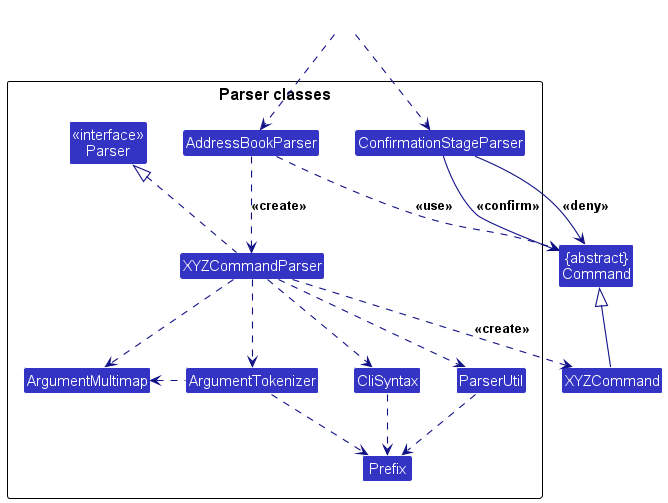

How the parsing works:
* When called upon to parse a user command, the `AddressBookParser` class creates an `XYZCommandParser` (`XYZ` is a placeholder for the specific command name e.g., `AddCommandParser`) which uses the other classes shown above to parse the user command and create a `XYZCommand` object (e.g., `AddCommand`) which the `AddressBookParser` returns back as a `Command` object.
* When called upon to parse a user command, the `ConfirmationStageParser` class checks if the command is "Y" or "N", representing confirming or denying the previous `ConfirmableCommand` respectively, then returns the respective stored command obtained from the previous command (e.g. `AbortDeleteCommand`).
* All `XYZCommandParser` classes (e.g., `AddCommandParser`, `DeleteCommandParser`, ...) inherit from the `Parser` interface so that they can be treated similarly where possible e.g, during testing.

### Model component
**API** : [`Model.java`](https://github.com/AY2324S2-CS2103T-W08-1/tp/blob/master/src/main/java/seedu/hirehub/model/Model.java)

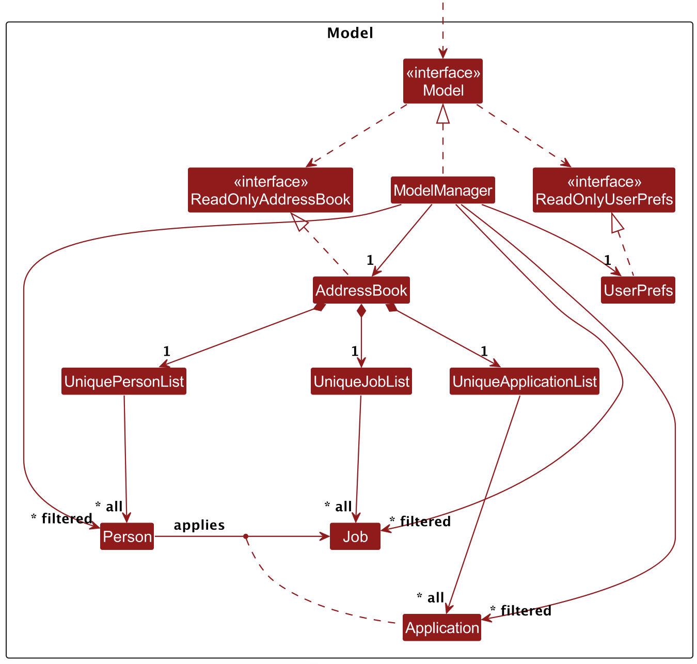

The `Model` component,

* stores the app data i.e., all `Person`, `Job`, and `Application` objects (which are contained in a `UniquePersonList`, `UniqueJobList` and `UniqueApplicationList` object, respectively).
* stores the currently 'selected' `Person`, `Job`, and `Application` objects (e.g., results of a search queries for each `Person`, `Job`, and `Application` object) as a separate _filtered_ list (`filteredPersonList`, `filteredJobList`, and `filteredApplicationList` respectively) which is exposed to outsiders as an unmodifiable `ObservableList<Person>`, `ObservableList<Job>`, and `ObservableList<Application>`, respectively, that can be 'observed' e.g. the UI can be bound to this list so that the UI automatically updates when the data in the list change.
* stores a `UserPref` object that represents the user’s preferences. This is exposed to the outside as a `ReadOnlyUserPref` objects.
* does not depend on any of the other three components (as the `Model` represents data entities of the domain, they should make sense on their own without depending on other components)

Association between Person, Job and Application classes with attributes of respective classes is represented with greater detail in the following UML Diagram:

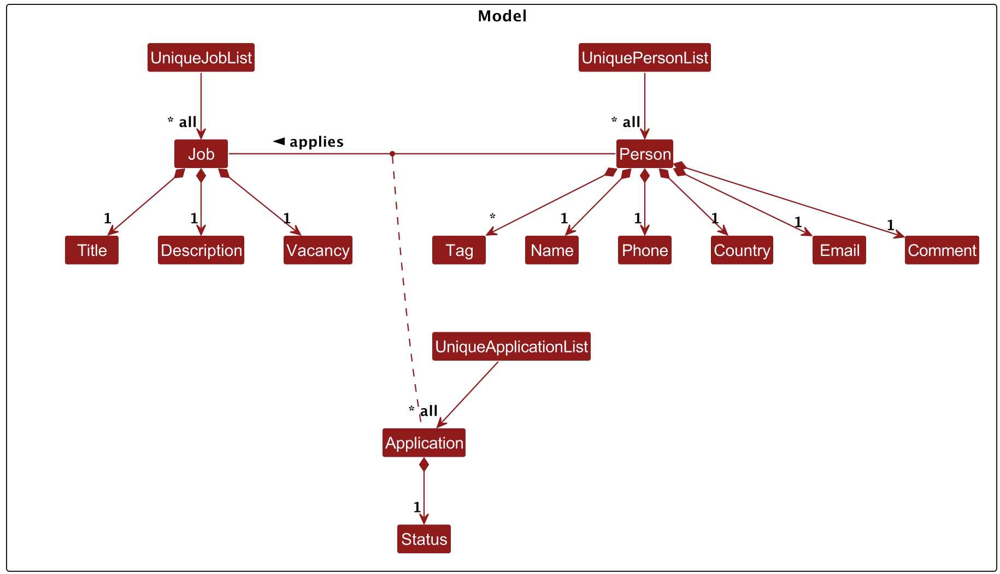

:information_source: **Note:** An alternative (arguably, a more OOP) model is given below. It has a `Tag` list in the `AddressBook`, which `Person` references. This allows `AddressBook` to only require one `Tag` object per unique tag, instead of each `Person` needing their own `Tag` objects. 

### Storage component

**API** : [`Storage.java`](https://github.com/AY2324S2-CS2103T-W08-1/tp/blob/master/src/main/java/seedu/hirehub/storage/Storage.java)

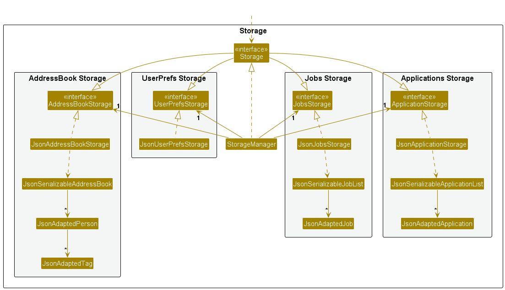

The `Storage` component,
* can save both address book data and user preference data in JSON format, and read them back into corresponding objects.
* inherits from `AddressBookStorage`, `ApplicationStorage`, `JobsStorage`, and `UserPrefsStorage`, which means it can be treated as any combination of the four storage interfaces (if only the functionality of a subset is needed).
* depends on some classes in the `Model` component (because the `Storage` component's job is to save/retrieve objects that belong to the `Model`)

### Common classes

Classes used by multiple components are in the `seedu.hirehub.commons` package.

--------------------------------------------------------------------------------------------------------------------

## **Implementation**

This section describes some noteworthy details on how certain features are implemented.

### edit_job command
The edit_job command allows the recruiters to edit the details (job title, description, vacancy) for a particular job at a specified index from the displayed job list. Given below is an example usage scenario and how the edit_job mechanism behaves at each step.

Step 1. The user launches the application for the first time. `HireHub` will be initialized with the initial address book state.

Step 2. The user types `edit_job 2 d/Good at OOP` to change the description of the job at index 2 to `Good at OOP`. This input is passed as an argument to `MainWindow#executeCommand(String)`, which subsequently calls `LogicManager#execute(String)`, which subsequently calls `AddressBookParser#parseCommand(String)`, which then calls `EditJobCommandParser#parse(String)`.

Step 3. `EditJobCommandParser#parse(String)` first checks if the given index is valid, before creating a new `EditJobDescriptor` object, which contains the attributes with the edited information that the `Job` object should have, if present. In this case, it contains `Good at OOP` for its `description` and `null` for the rest. `EditJobCommandParser#parse(String)` then parses the command to return a new `EditJobCommand` object containing the `EditJobDescriptor` object.

Step 4. `EditJobCommand#execute(Model)` is then called in `LogicManager#execute(String)`, where the old job is updated in the job list with `ModelManager#setJob(Job, Job)`, the filtered job list in the model is updated with `ModelManager#updateFilteredJobList(Predicate<Job>)`, and the applications in the application list are updated to contain the edited job with `ModelManager#replaceApplications(Job, Job)`.

**Design considerations:**

**Aspect: Format of edit_job command:**

**Alternative 1 (current choice):** Use index as argument.

Pros: It is easier for the user to type out the index to use the command.

Cons: This choice requires the user to know the index, which can only be observed from the UI. If there is a long list of jobs in the UI, observing from the UI may not be so feasible.

We choose this alternative because we have a search_job command which supports narrowing down of the jobs list to find the desired job.

**Alternative 2:** Use job title as argument.

Pros: Job title is usually known beforehand, and job title is the unique primary key for all jobs in the list.

Cons: Job title can be quite long and cumbersome for users to type out.

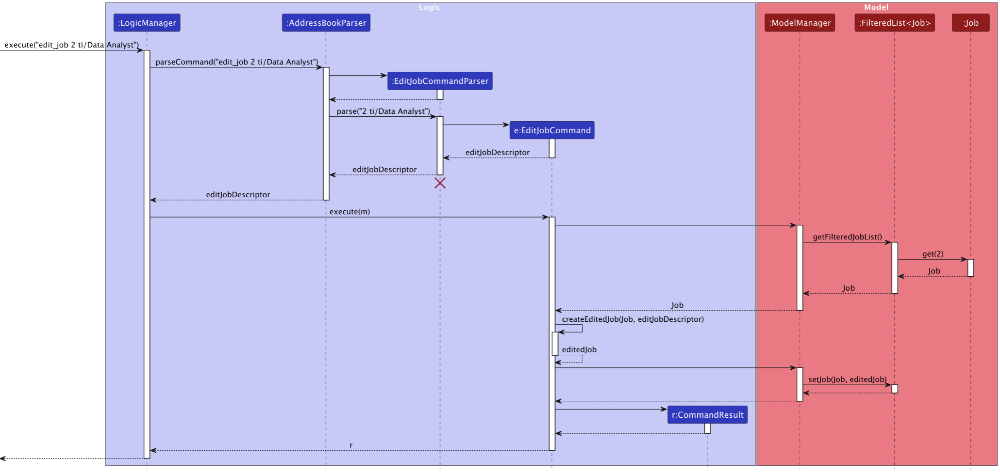

### get command

The get command allows the recruiters to retrieve the candidate from the list at specified index in the displayed candidate list. If a recruiter types in `get INDEX` with valid index, it returns the candidate at that specific index in the list of candidates displayed in the UI. Specifically, get command is implemented via the following steps:

1. `GetCommand` class was created in `Command` file in `Logic` component which constructs a `GetCommand` object with candidate index as an argument.
2. `execute()` method in `GetCommand` class checks whether index provided by the user is valid (i.e. positive integer should be smaller than or equal to the size of displayed candidate list) or not, and filters the candidate list with given index number, creating a new `CommandResult` object that outputs success message.
3. In order for get command to get into the `Logic` component, user command must be parsed in `parser` component. In order to do so, `GetCommandParser` was created by implementing `Parser<T>` interface in the `parser` component where `parse()` method creates a `GetCommand` object with given index as an argument.

Given below is an example usage scenario and how the get command mechanism behaves at each step, which could aid understanding the implementation outlined above:

Step 1. The user launches the application for the first time. `HireHub` will be initialized with the initial address book state.

Step 2. The user executes `get 3` command to retrieve candidate at 3rd entry in the list displayed by UI. Subsequently, `get 3` command calls `GetCommandParser#parse()`, parsing the command and creating a new `GetCommand` object by calling constructor `GetCommand(3)`.

Step 3. `GetCommand#execute()` checks whether index 3 is valid argument, and if it is within the valid range, it creates `CommandResult` object to deliver success messages to `LogicManager` class.

The following sequence diagram shows how a get operation goes through the `Logic` component:

**Design considerations:**

**Aspect: Format of get command:**

**Alternative 1 (current choice):** Use index as argument.

Pros: It is easier for the user to type out the index at the end user's side.

Cons: This requires the user to know the index from the list of candidates displayed in the UI. If there is a long list of candidates in the UI, observing from the UI may not be so feasible.

We choose this alternative because we have a search command which supports narrowing down of the candidate list to find the desired candidate.

**Alternative 2:** Use candidate's email as argument.

Pros: Email is usually known beforehand midst of the recruitment process, and email is the unique primary key for all candidates in the list.

Cons: Email could possibly be a bit long and cumbersome for users to type out.

### search command

The search command searches candidates whose attributes match all the corresponding attributes (i.e. intersection of all the matches). Phone, email and country are matched by equality, while name, comment, tag are matched by substring of the candidate attributes. The search operation is executed as follows:

Step 1. The user launches the application for the first time. `HireHub` will be initialized with the initial address book state.

Step 2. The user types `search n/l c/SG` to retrieve candidates whose name contains `l`and whose country is `SG`. This calls `MainWindow#execute(String)`, which subsequently calls `LogicManager#execute(String)`, which subsequently calls `AddressBookParser#parseCommand(String)`, which then calls `SearchCommandParser#parse(String)`.

Step 3. `SearchCommandParser#parse(String)` creates a new `SearchPersonDescriptor` object, which contains the attributes with the required information that a `Person` object should match, if present. In this case, it contains `l` for its `name` attribute and `SG` for its `country` attribute, and `null` for the rest. `SearchCommandParser#parse(String)` then parses the command to return a new `SearchCommand` object containing the `SearchPersonDescriptor` object.

Step 4. `SearchCommand#execute(Model)` is then called in `LogicManager#execute(String)`, where `SearchPersonDescriptor#getPredicate()` uses the attributes in `SearchPersonDescriptor` to create `ContainsKeywordsPredicate` objects (e.g. `ContainsKeywordsPredicate("n/", Optional.of("l"))`) with the corresponding prefixes and information, before returning a new `SearchPredicate` object containing these `ContainsKeywordsPredicate` objects. Note that a `ContainsKeywordsPredicate` object is created for each attribute, even if it is `null`.

Step 5. `ModelManager#updateFilteredPerson(Predicate<Person>)` (with the `SearchPredicate` object as its argument) is called, where `SearchPredicate#test(Person)` is called. Then for each predicate in the `SearchPredicate` object, `ContainsKeywordsPredicate#test(Person)` is called, which checks if one of the specified attribute contains the specified information (e.g. `ContainsKeywordsPredicate("n/", Optional.of("l"))` tests if `name` contains `l`). `SearchPredicate#test(Person)` then returns people in which **all** `ContainsKeywordsPredicate#test(Person)` in the `SearchPredicate` return `true`. `ModelManager#updateFilteredPerson(Predicate<Person>)` then updates the model to display such people only.

The following sequence diagram shows how a search operation goes through the various components:

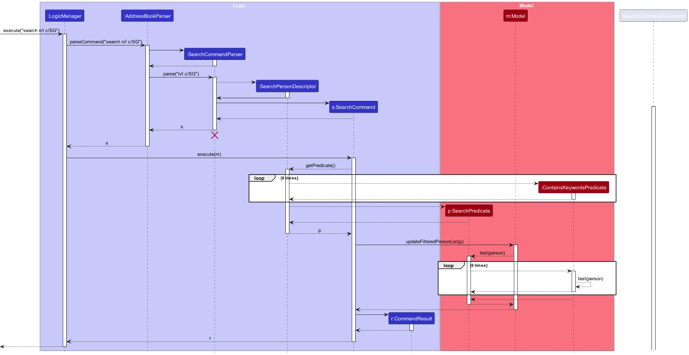

**Design considerations:**

**Aspect: Search criteria of search command:**

**Alternative 1 (current choice):** Return candidates that match all the specified attributes.

Pros: The user can shrink down the result list by specifying more attributes, making it easier to find a particular candidate.

Cons: The user may need to run multiple search commands to find candidates that match one of the specified attributes.

We choose this alternative because the recruiter tends to have a specific candidate in mind, so narrowing down the list quickly is more useful. Furthermore, this has a better niche, as finding candidates matching one of the specified attributes is easier, while finding candidates matching all the specified attributes is harder.

**Alternative 2:** Return candidates that match one of the specified attributes.

Pros: It is helpful for recruiters who may have multiple possible criteria for candidates to meet. This helps to keep options open and not accidentally neglect a candidate.

Cons: It is harder to shrink down the result list as specifying more attributes only increases the size of the result list. Also, finding candidates that match all the specified attributes is difficult, as the user needs to keep track of the candidates that appear in all the result lists, over multiple search commands.

### slots_left command

The slots_left command finds the remaining vacancies of a specified job at the specified index of the displayed list of jobs. The remaining vacancies is the number of vacancies of the job, subtracted by the number of `OFFERED` applications to that job. The slots_left operation is executed as follows:

Step 1. The user launches the application for the first time. `HireHub` will be initialized with the initial address book state.

Step 2. The user types `slots_left 3` to find the number of remaining vacancies of the job with index `3`. This calls `MainWindow#execute(String)`, which subsequently calls `LogicManager#execute(String)`, which subsequently calls `AddressBookParser#parseCommand(String)`, which then calls `SlotsLeftCommandParser#parse(String)`.

Step 3. `SlotsLeftCommandParser#parse(String)` creates a new `SlotsLeftCommand` object, which contains the index of the job.

Step 4. `SlotsLeftCommand#execute(Model)` is then called in `LogicManager#execute(String)`, where `ModelManager#getFilteredJobList()` is called. `List#get(int)` is then called, which returns a job object. `Job#getTitle()` is then called to return a String (the title of the job), which is then used as an argument for `ModelManager#countRemainingVacancy(String)`, returning the number of remaining vacancies of the job.

The following sequence diagram shows how a slots_left operation goes through the various components:

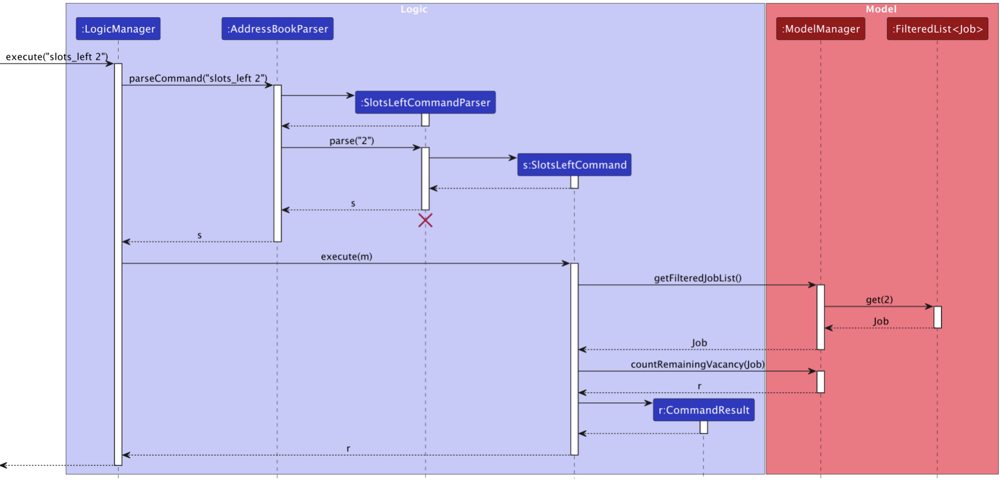

**Design Consideration:**

**Aspect:** Rationale behind implementation of slots_left command:

At the outset, there were discussions centered around whether `vacancy` attribute for the job class should denote the remaining count of job openings or the total number of candidates intended for recruitment by the hiring entity. In consideration of the potential for recruiters to adjust the vacancy count for a given job and make references to the initial vacancy, we decided that the `vacancy` attribute shall denote the total number of positions that the recruiters aim to hire. To support enabling recruiters to ascertain the number of remaining job openings after deducting the number of offers made, a 'slots_left' command was created for this purpose.

### add_app command

The add_app command adds an application containing a job and a person.

Step 1. The user launches the application for the first time. `HireHub` will be initialized with the initial address book state. We assume that there is an existing person and job in the initial address book state - a person with an email `example@gmail.com` and a job with title `job`.

Step 2. The user enters `add_app e/example@gmail.com ti/job` to add an application for the person uniquely identified by the email `example@gmail.com`, for the job with the title `job`. This calls `MainWindow#execute(String)`, which subsequently calls `LogicManager#execute(String)`, which subsequently calls `AddressBookParser#parseCommand(String)`, which then calls `AddApplicationCommandParser#parse(String)`.

Step 3. `AddApplicationCommandParser#parse(String)` creates a new `AddApplicationCommand` object, which contains the email that a `Person` object should match, and the job title the `Job` should match. In this case, it contains `example@gmail.com` for its `email` attribute and `job` for its `title` attribute, and `PRESCREEN` for the `status` attribute by default.

Step 4.`AddApplicationCommand#execute(Model)` is then called in `LogicManager#execute(String)`, where the matching `Person` and `Job` are found, and an `Application` object containing the `Person` and the `Job` is created. `model#addApplication(Application)` is then called and the `Application` is added to the list of `Application`s in `model`.

**Design considerations:**

**Aspect:** Format of add_app command:

**Alternative 1 (current choice):** Use primary keys for `Person` (`Email`) and `Job` (job `Title`) as arguments.

Pros: `Email` of a candidate and the job `Title` that the candidate applies for are usually known beforehand to the recruiters, and they are unique primary keys for all candidates and jobs in their respective lists.

Cons: It is harder for the users to type out the email of a candidate and job title that the candidate intends to apply to use the command.

We choose this alternative because recruiters can reduce the probability of adding incorrect application by enforcing them to explicitly type out a candidate's email and a job title that the candidate applies for.

**Alternative 2:** Use an index of Candidate (`Person`) in the candidate list and an index of job in the job list as an input.

Pros: It is easier for the users to type out index of candidates and jobs displayed in their respective lists than writing email and job title everytime.

Cons: Recruiters need to scroll down the list of candidates and jobs in order to find respective indices, which could require additional effort. Recruiters might be prone to make a mistake since they need to identify candidates and job via indices, and it might be confusing for them to discern which index is for candidates and which one is for job when using this command.

The following sequence diagram shows how a add_app operation goes through the various components:

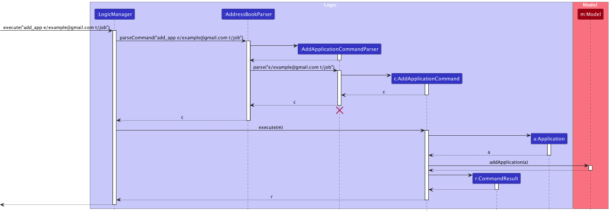

### tag command

The tag command adds one or more tags to a person. The person retains all tags it had before.

Step 1. The user launches the application for the first time. `HireHub` will be initialized with the initial address book state. We assume that there is an existing person in the initial address book state - a person at index 1 with tag `t/tag0`.

Step 2. The user enters `tag 1 t/tag1 t/tag2` to add tags to the candidate at 1st entry in the list displayed by UI. This calls `MainWindow#execute(String)`, which subsequently calls `LogicManager#execute(String)`, which subsequently calls `AddressBookParser#parseCommand(String)`, which then calls `TagCommandParser#parse(String)`.

Step 3. `TagCommandParser#parse(String)` creates a new `TagCommand` object, which contains the index that a `Person` object should match, and the `Set<Tag>` of tags to add. In this case, it contains the index 1 and a `Set<Tag>` `[t/tag1, t/tag2]`.

Step 4.`TagCommand#execute(Model)` is then called in `LogicManager#execute(String)`, where the matching `Person` is found and the union of tags present and tags to add is calculated. A new person is created using the tag union and the old person's data. Then, the old person is updated in the person list with `ModelManager#setPerson(Person, Person)`, the filtered person list in the model is updated with `ModelManager#updateFilteredPersonList(Predicate<Person>)`, and the applications in the application list are updated to contain the edited person with `ModelManager#replaceApplications(Person, Person)`.

The following sequence diagram shows how a tag operation goes through the various components:

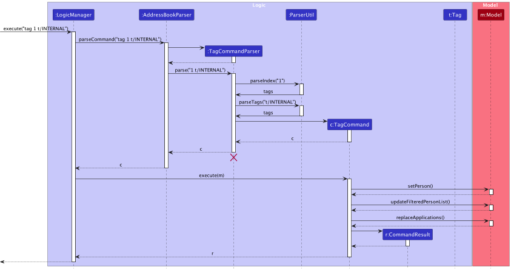

### \[Proposed\] Undo/redo feature

#### Proposed Implementation

The proposed undo/redo mechanism is facilitated by `VersionedAddressBook`. It extends `AddressBook` with an undo/redo history, stored internally as an `addressBookStateList` and `currentStatePointer`. Additionally, it implements the following operations:

* `VersionedAddressBook#commit()` — Saves the current address book state in its history.
* `VersionedAddressBook#undo()` — Restores the previous address book state from its history.
* `VersionedAddressBook#redo()` — Restores a previously undone address book state from its history.

These operations are exposed in the `Model` interface as `Model#commitAddressBook()`, `Model#undoAddressBook()` and `Model#redoAddressBook()` respectively.

Given below is an example usage scenario and how the undo/redo mechanism behaves at each step.

Step 1. The user launches the application for the first time. The `VersionedAddressBook` will be initialized with the initial address book state, and the `currentStatePointer` pointing to that single address book state.

Step 2. The user executes `delete 5` command to delete the 5th person in the address book. The `delete` command calls `Model#commitAddressBook()`, causing the modified state of the address book after the `delete 5` command executes to be saved in the `addressBookStateList`, and the `currentStatePointer` is shifted to the newly inserted address book state.

Step 3. The user executes `add n/David …​` to add a new person. The `add` command also calls `Model#commitAddressBook()`, causing another modified address book state to be saved into the `addressBookStateList`.

:information_source: **Note:** If a command fails its execution, it will not call `Model#commitAddressBook()`, so the address book state will not be saved into the `addressBookStateList`.

Step 4. The user now decides that adding the person was a mistake, and decides to undo that action by executing the `undo` command. The `undo` command will call `Model#undoAddressBook()`, which will shift the `currentStatePointer` once to the left, pointing it to the previous address book state, and restores the address book to that state.

:information_source: **Note:** If the `currentStatePointer` is at index 0, pointing to the initial AddressBook state, then there are no previous AddressBook states to restore. The `undo` command uses `Model#canUndoAddressBook()` to check if this is the case. If so, it will return an error to the user rather
than attempting to perform the undo.

The following sequence diagram shows how an undo operation goes through the `Logic` component:

:information_source: **Note:** The lifeline for `UndoCommand` should end at the destroy marker (X) but due to a limitation of PlantUML, the lifeline reaches the end of diagram.

Similarly, how an undo operation goes through the `Model` component is shown below:

The `redo` command does the opposite — it calls `Model#redoAddressBook()`, which shifts the `currentStatePointer` once to the right, pointing to the previously undone state, and restores the address book to that state.

:information_source: **Note:** If the `currentStatePointer` is at index `addressBookStateList.size() - 1`, pointing to the latest address book state, then there are no undone AddressBook states to restore. The `redo` command uses `Model#canRedoAddressBook()` to check if this is the case. If so, it will return an error to the user rather than attempting to perform the redo.

Step 5. The user then decides to execute the command `list`. Commands that do not modify the address book, such as `list`, will usually not call `Model#commitAddressBook()`, `Model#undoAddressBook()` or `Model#redoAddressBook()`. Thus, the `addressBookStateList` remains unchanged.

Step 6. The user executes `clear`, which calls `Model#commitAddressBook()`. Since the `currentStatePointer` is not pointing at the end of the `addressBookStateList`, all address book states after the `currentStatePointer` will be purged. Reason: It no longer makes sense to redo the `add n/David …​` command. This is the behavior that most modern desktop applications follow.

The following activity diagram summarizes what happens when a user executes a new command:

#### Design considerations:

**Aspect: How undo & redo executes:**

* **Alternative 1 (current choice):** Saves the entire address book.
  * Pros: Easy to implement.
  * Cons: May have performance issues in terms of memory usage.

* **Alternative 2:** Individual command knows how to undo/redo by
  itself.
  * Pros: Will use less memory (e.g. for `delete`, just save the person being deleted).
  * Cons: We must ensure that the implementation of each individual command are correct.

--------------------------------------------------------------------------------------------------------------------

## **Documentation, logging, testing, configuration, dev-ops**

* [Documentation guide](Documentation.md)
* [Testing guide](Testing.md)
* [Logging guide](Logging.md)
* [Configuration guide](Configuration.md)
* [DevOps guide](DevOps.md)

--------------------------------------------------------------------------------------------------------------------

## **Appendix: Requirements**

### Product scope

**Target user profile**:

* has a need to manage a significant number of candidates to fill vacancies
* wants to oversee and provide updates to candidates in the interview pipeline
* prefer desktop apps over other types
* can type fast
* prefers typing to mouse interactions
* is reasonably comfortable using CLI apps

**Value proposition**: manage and track candidates throughout the interview process, faster than a typical mouse/GUI driven app

### User stories

Priorities: High (must have) - `* * *`, Medium (nice to have) - `* *`, Low (unlikely to have) - `*`

| Priority | As a …​            | I want to …​                                                              | So that I can…​                                                                                                           |
|----------|--------------------|---------------------------------------------------------------------------|---------------------------------------------------------------------------------------------------------------------------|
| `* * *`  | recruiter          | update the contact details of potential candidates                        | quickly fix mistakes or update outdated data                                                                              |
| `* * *`  | recruiter          | view the contact details of potential candidates in tabular format        | read the data more easily                                                                                                 |
| `* * *`  | recruiter          | add new candidates to the candidate list                                  | expand my network of contacts                                                                                             |
| `* * *`  | recruiter          | delete candidates from the candidate list                                 | comply with candidates' request to delete information in accordance with privacy acts or when the information is outdated |
| `* * *`  | recruiter          | add tags to categorise candidates                                         | easily find candidates fulfilling a particular criteria (tag)                                                             |
| `* * *`  | recruiter          | filter candidates by their attributes                                     | easily seek out for the relevant candidates                                                                               |
| `* * *`  | recruiter          | leave a comment on the candidate profile                                  | take note of the important aspects of the candidate for future reference                                                  |
| `* * *`  | recruiter          | keep track of the candidate's interview status for particular application | facilitate the interview process                                                                                          |
| `* * *`  | recruiter          | clear the database in one single command                                  | avoid typing multiple delete commands                                                                                     |
| `* * *`  | recruiter          | view the details of a candidate of a particular row in the candidate list | have an absolute reference of the singular candidate that I am interested in                                              |
| `* * *`  | recruiter          | filter candidates by the jobs they applied                                | see what jobs they apply for                                                                                              |
| `* * *`  | recruiter          | filter applications by job                                                | have an overview of all the applications for a particular job for easier processing                                       |
| `* * *`  | recruiter          | delete specific tags                                                      | undo mistakes made when adding tags                                                                                       |
| `* * `   | recruiter          | view the number of vacancies left for each role                           | know when to stop hiring/accepting new candidates                                                                         |
| `* *`    | careless recruiter | confirm the clearing of the candidate list                                | avoid any accidental deletion of the candidate list                                                                       |

### Use cases

**<u>Add candidate</u>**

**System**: Hirehub (Candidate Management System for Company Recruiters)

**Use case**: UC01 - Add Candidate to the List

**Actor**: Recruiter

**MSS**

1.  Recruiter enters the details of the candidate to be added to the list.
2.  Hirehub adds the candidate with the corresponding details as requested.
3.  Hirehub displays the details of the added candidate.

Use case ends.

**Extensions**

* 1a. Recruiter enters invalid email address.
    - 1a1. Hirehub raises an error and asks recruiter to provide valid email address.
    - 1a2. Recruiter attempts to add the candidate with valid email address.
    - Steps 1a1-1a2 are repeated until the email address entered is in a correct format.
    - Use case resumes from step 2.

* 1b. Recruiter enters invalid phone number.
    - 1b1. Hirehub raises an error and asks recruiter to provide phone number in a correct format.
    - 1b2. Recruiter attempts to add the candidate with valid phone number.
    - Steps 1b1-1b2 are repeated until the phone number entered is in the correct format.
    - Use case resumes from step 2.

* 1c. Recruiter enters invalid country code.
    - 1c1. Hirehub raises an error and asks recruiter to provide available country code listed in the user guide.
    - 1c2. Recruiter attempts to add the candidate with valid country code.
    - Steps 1c1-1c2 are repeated until the country code entered is in the list of available country codes in the user guide.
    - Use case resumes from step 2.

* 1d. Recruiter attempts to add the comment field of candidate.
    - 1d1. Hirehub raises an error and asks recruiter to use other method to add candidate comment.
    - 1d2. Recruiter attempts to add the candidate without the comment field.
    - Steps 1d1-1d2 are repeated until the recruiter stops attempting to add the comment field.
    - Use case resumes from step 2.

* 1e. Recruiter does not enter either name, email, country or phone in the attribute field.
    - 1e1. Hirehub raises an error and asks the recruiter to provide name, email, country and phone of the candidate to be added.
    - 1e2. Recruiter attempts to add the candidate with name, email, country and phone.
    - Steps 1e1-1e2 are repeated until the recruiter enters name, email, country and phone.
    - Use case resumes from step 2.

---

**<u>Delete candidate</u>**

**System**: Hirehub (Candidate Management System for Company Recruiters)

**Use case**: UC02 - Delete Candidate from the List

**Actor**: Recruiter

**MSS**

1. Recruiter finds a candidate index to delete from the list displayed in the app.
2. Recruiter deletes the candidate.
3. Hirehub requests the recruiter to confirm the deletion.
4. Recruiter confirms deletion.
5. Hirehub deletes the candidate from the list and displays the deleted candidate with its attributes.

Use case ends.

**Extensions**

* 2a. Recruiter enters invalid candidate index.
    - 2a1. Hirehub raises an error and asks recruiter to provide valid candidate index.
    - 2a2. Recruiter attempts to delete the candidate with valid candidate index.
    - Steps 2a1-2a2 are repeated until the candidate index entered is correct.
    - Use case resumes from step 3.

* 4a. Recruiter cancels deletion in confirmation stage.
    - 4a1. Hirehub exits the deletion process.
    - Use case ends.

* 4b. Recruiter enters invalid input for confirmation page.
    - 4b1. Hirehub prompts the recruiter to enter a valid input.
    - Use case 4b is repeated if the recruiter enters invalid input for the confirmation page again.
    - Use case resumes from step 5 if recruiter confirms deletion.
    - Use case resumes from step 4a if recruiter cancels deletion.

---

**<u>Edit candidate details</u>**

**System**: Hirehub (Candidate Management System for Company Recruiters)

**Use case**: UC03 - Edit Candidate from the List

**Actor**: Recruiter

**MSS**

1. Recruiter finds a candidate index to edit from the list displayed in the app.
2. Recruiter enters the candidate details to update in the list.
3. Hirehub updates the candidate details as requested.
4. Hirehub displays the edited candidate with the edited attributes.

Use case ends.

**Extensions**

* 2a. Recruiter enters a candidate index that is not a positive integer.
    - 2a1. Hirehub raises an error and asks recruiter to provide valid candidate index.
    - 2a2. Recruiter attempts to edit the candidate with valid candidate index.
    - Steps 2a1-2a2 are repeated until the candidate index entered is valid.
    - Use case resumes from step 3.

* 2b. Recruiter enters invalid email address.
    - 2b1. Hirehub raises an error and asks recruiter to provide valid email address.
    - 2b2. Recruiter attempts to edit the candidate with valid email address.
    - Steps 2b1-2b2 are repeated until the email address entered is in a correct format.
    - Use case resumes from step 3.

* 2c. Recruiter enters invalid phone number.
    - 2c1. Hirehub raises an error and asks recruiter to provide phone number in a correct format.
    - 2c2. Recruiter attempts to edit the candidate with valid phone number.
    - Steps 2c1-2c2 are repeated until the phone number entered is in the correct format.
    - Use case resumes from step 3.

* 2d. Recruiter enters invalid country code.
    - 2d1. Hirehub raises an error and asks recruiter to provide available country code listed in the user guide.
    - 2d2. Recruiter attempts to edit the candidate with valid country code.
    - Steps 2d1-2d2 are repeated until the country code entered is in the list of available country codes in the user guide.
    - Use case resumes from step 3.

* 2e. Recruiter attempts to edit the comment field of candidate.
    - 2e1. Hirehub raises an error and asks recruiter to use other method to update candidate comment.
    - 2e2. Recruiter attempts to edit the candidate without the comment field.
    - Steps 2e1-2e2 are repeated until the recruiter stops attempting to update the comment field.
    - Use case resumes from step 3.

* 2f. No attributes are provided by recruiter to update.
    - 2f1. Hirehub raises an error and asks the recruiter to provide at least one attribute to update.
    - 2f2. Recruiter attempts to edit the candidate with at least one attribute to update.
    - Steps 2f1-2f2 are repeated until recruiter enters at least one attribute to update.
    - Use case resumes from step 3.

* 2g. Recruiter enters a positive integer for candidate index that is out of range.
    - 2g1. Hirehub raises an error and asks the recruiter to provide correct candidate index from 1 to the number of candidates in the list.
    - 2g2. Recruiter attempts to edit the candidate with valid candidate index within the range.
    - Steps 2g1-2g2 are repeated until recruiter enters valid candidate index.
    - Use case resumes from step 3.

---

**<u>Clear</u>**

**System**: Hirehub (Candidate Management System for Company Recruiters)

**Use case**: UC04 - Clear candidates from the list

**Actor**: Recruiter

**MSS**

1. Recruiter enters the command to clear the database.
2. HireHub prompts recruiter to confirm the clearing.
3. Recruiter enters input into the command box to confirm the clearing.
4. The database is cleared.

Use case ends.

**Extensions**

1a. Recruiter types in additional stuff after ‘clear’ e.g. ‘clear 1’.
- Use case resumes from step 2.

3a. Recruiter tries to enter invalid commands in the command box.
- 3a1. HireHub prompts recruiter to enter valid input.
- Use case 3a is repeated if the recruiter enters invalid input for the confirmation page again.
- Use case resumes from step 4 if recruiter confirms deletion.
- Use case resumes from step 3b if recruiter cancels deletion.

3b. Recruiter aborts the clearing.
- 3b1. HireHub informs recruiter that the clear of the database has been aborted.
- Use case ends.

---

**<u>Add job</u>**

**System**: Hirehub (Candidate Management System for Company Recruiters)

**Use case**: UC05 - Add jobs to the list

**Actor**: Recruiter

**MSS**

1.  Recruiter enters the details of the job to be added to the list.
2.  Hirehub adds the job with the corresponding details as requested.
3.  Hirehub displays the details of the added job.

Use case ends.

**Extensions**

* 1a. Recruiter enters invalid job title.
  - 1a1. Hirehub raises an error and asks recruiter to provide valid job title.
  - 1a2. Recruiter attempts to add the job with valid job title.
  - Steps 1a1-1a2 are repeated until the job title entered is in a correct format.
  - Use case resumes from step 2.

* 1b. Recruiter enters invalid vacancy.
  - 1b1. Hirehub raises an error and asks recruiter to provide valid vacancy.
  - 1b2. Recruiter attempts to add the job with valid vacancy.
  - Steps 1b1-1b2 are repeated until the vacancy entered is valid.
  - Use case resumes from step 2.

---

**<u>Delete job</u>**

**System**: Hirehub (Candidate Management System for Company Recruiters)

**Use case**: UC06 - Delete job from the List

**Actor**: Recruiter

**MSS**

1. Recruiter finds a job index to delete from the list displayed in the app.
2. Recruiter deletes the job.
3. Hirehub requests the recruiter to confirm the deletion.
4. Recruiter confirms deletion.
5. Hirehub deletes the job from the list and displays the deleted job with its attributes.

Use case ends.

**Extensions**

* 2a. Recruiter enters invalid job index.
  - 2a1. Hirehub raises an error and asks recruiter to provide valid job index.
  - 2a2. Recruiter attempts to delete the job with valid job index.
  - Steps 2a1-2a2 are repeated until the job index entered is correct.
  - Use case resumes from step 3.

* 4a. Recruiter cancels deletion in confirmation stage.
  - 4a1. Hirehub exits the deletion process.
  - Use case ends.

* 4b. Recruiter enters invalid input for confirmation page.
  - 4b1. Hirehub prompts the recruiter to enter a valid input.
  - Use case 4b is repeated if the recruiter enters invalid input for the confirmation page again.
  - Use case resumes from step 5 if recruiter confirms deletion.
  - Use case resumes from step 4a if recruiter cancels deletion.

---

**<u>Edit job details</u>**

**System**: Hirehub (Candidate Management System for Company Recruiters)

**Use case**: UC07 - Edit Job from the List

**Actor**: Recruiter

**MSS**

1. Recruiter finds a job index to edit from the list displayed in the app.
2. Recruiter enters the job details to update in the list.
3. Hirehub updates the job details as requested.
4. Hirehub displays the edited job with the edited attributes.

Use case ends.

**Extensions**

* 2a. Recruiter enters invalid job index that is not a positive integer.
  - 2a1. Hirehub raises an error and asks recruiter to provide a valid job index.
  - 2a2. Recruiter attempts to edit the job with a valid job index.
  - Steps 2a1-2a2 are repeated until the job index entered is correct.
  - Use case resumes from step 3.

* 2b. Recruiter enters invalid job title.
  - 2b1. Hirehub raises an error and asks recruiter to provide a valid job title.
  - 2b2. Recruiter attempts to edit the job with a valid job title.
  - Steps 2b1-2b2 are repeated until the job title entered is in a correct format.
  - Use case resumes from step 3.

* 2c. Recruiter enters invalid vacancy.
  - 2c1. Hirehub raises an error and asks recruiter to provide a valid vacancy.
  - 2c2. Recruiter attempts to edit the job with valid vacancy.
  - Steps 2c1-2c2 are repeated until the vacancy entered is valid.
  - Use case resumes from step 3.

* 2d. No attributes are provided by recruiter to update.
  - 2d1. Hirehub raises an error and asks the recruiter to provide at least one attribute to update.
  - 2d2. Recruiter attempts to edit the job with at least one attribute to update.
  - Steps 2d1-2d2 are repeated until recruiter enters at least one attribute to update.
  - Use case resumes from step 3.

* 2e. Recruiter enters a positive integer for job index that is out of range.
  - 2e1. Hirehub raises an error and asks the recruiter to provide correct job index from 1 to the number of jobs in the list.
  - 2e2. Recruiter attempts to edit the job with valid job index within the range.
  - Steps 2e1-2e2 are repeated until recruiter enters valid job index.
  - Use case resumes from step 3.

* 2f. Recruiter enters a vacancy that is fewer than the current number of OFFERED applications to the job.
  - 2f1. Hirehub raises an error and asks the recruiter to provide a larger vacancy.
  - 2f2. Recruiter attempts to edit the job with a vacancy that is not fewer than the current number of OFFERED applications to the job.
  - Steps 2f1-2f2 are repeated until recruiter enters a vacancy that is not fewer than the current number of OFFERED applications to the job.
  - Use case resumes from step 3.

---

**<u>Add application</u>**

**System**: Hirehub (Candidate Management System for Company Recruiters)

**Use case**: UC08 - Add application to the List

**Actor**: Recruiter

**MSS**

1.  Recruiter enters the details of the application to be added to the list.
2.  Hirehub adds the application with the corresponding details as requested.
3.  Hirehub displays the details of the added application.

Use case ends.

**Extensions**

* 1a. Recruiter enters invalid email address.
  - 1a1. Hirehub raises an error and asks recruiter to provide valid email address.
  - 1a2. Recruiter attempts to add the application of a person with valid email address.
  - Steps 1a1-1a2 are repeated until the email address entered is in a correct format.
  - Use case resumes from step 2.

* 1b. Recruiter enters invalid job title.
  - 1b1. Hirehub raises an error and asks recruiter to provide valid job title.
  - 1b2. Recruiter attempts to add the application to a job with a valid job title.
  - Steps 1b1-1b2 are repeated until the job title entered is in the correct format.
  - Use case resumes from step 2.

* 1c. Recruiter enters invalid status.
  - 1c1. Hirehub raises an error and asks recruiter to provide valid status.
  - 1c2. Recruiter attempts to add the application with valid status.
  - Steps 1c1-1c2 are repeated until the status entered is a valid status.
  - Use case resumes from step 2.

  
* 1d. Recruiter enters an email address that is not in the person list.
  - 1d1. Hirehub raises an error and asks recruiter to provide an email address that is in the list.
  - 1d2. Recruiter attempts to add the application of an existing person.
  - Steps 1d1-1d2 are repeated until the email address entered is an email address of an existing person.
  - Use case resumes from step 2. 

* 1e. Recruiter enters a job title that is not in the job list.
  - 1e1. Hirehub raises an error and asks recruiter to provide a job title that is in the list.
  - 1e2. Recruiter attempts to add the application to an existing job.
  - Steps 1e1-1e2 are repeated until the job title entered is a job title of an existing job.
  - Use case resumes from step 2.

---

**<u>Delete application</u>**

**System**: Hirehub (Candidate Management System for Company Recruiters)

**Use case**: UC09 - Delete application from the List

**Actor**: Recruiter

**MSS**

1. Recruiter finds an application index to delete from the application list displayed in the app.
2. Recruiter deletes the application.
3. Hirehub requests the recruiter to confirm the deletion.
4. Recruiter confirms deletion.
5. Hirehub deletes the application from the list and displays the deleted application with its attributes.

Use case ends.

**Extensions**

* 2a. Recruiter enters invalid application index.
  - 2a1. Hirehub raises an error and asks recruiter to provide valid application index.
  - 2a2. Recruiter attempts to delete the application with valid application index.
  - Steps 2a1-2a2 are repeated until the application index entered is correct.
  - Use case resumes from step 3.

* 4a. Recruiter cancels deletion in confirmation stage.
  - 4a1. Hirehub exits the deletion process.
  - Use case ends.

* 4b. Recruiter enters invalid input for confirmation page.
  - 4b1. Hirehub prompts the recruiter to enter a valid input.
  - Use case 4b is repeated if the recruiter enters invalid input for the confirmation page again.
  - Use case resumes from step 5 if recruiter confirms deletion.
  - Use case resumes from step 4a if recruiter cancels deletion.

---

### Non-Functional Requirements

1.  Should work on any _mainstream OS_ as long as it has Java `11` or above installed.
2.  Should be able to hold up to 1000 persons without a noticeable sluggishness in performance for typical usage.
3.  A user with above average typing speed for regular English text (i.e. not code, not system admin commands) should be able to accomplish most of the tasks faster using commands than using the mouse.
4.  Should respond immediately to user input, as user will most likely be using a chain of commands
5.  Should be able to use offline
6.  The UI should be resizable as users will likely be referencing other tabs while using this product.

### Glossary

* **Mainstream OS**: Windows, Linux, Unix, MacOS
* **Private contact detail**: A contact detail that is not meant to be shared with others
* **Command**: The first word in the user input, determines 
* **GUI**: Graphical user interface
* **JSON**: JavaScript Object Notation

--------------------------------------------------------------------------------------------------------------------

## **Appendix: Instructions for manual testing**

Given below are instructions to test the app manually.

:information_source: **Note:** These instructions only provide a starting point for testers to work on;
testers are expected to do more *exploratory* testing.

### Launch and shutdown

1. Initial launch

   1. Download the jar file and copy into an empty folder

   1. Run the command `java -jar hirehub.jar` on the command line in the same directory or double-click the jar file. Expected: Shows the GUI with a set of sample contacts. The window size may not be optimum.

1. Saving window preferences

   1. Resize the window to an optimum size. Move the window to a different location. Close the window.

   1. Re-launch the app by running the command `java -jar hirehub.jar` on the command line in the same directory or double-clicking the jar file. 
       Expected: The most recent window size and location is retained.

### Deleting a person

1. Deleting a person while all persons are being shown

   1. Prerequisites: List all persons using the `list` command. Multiple persons in the list.

   1. Test case: `delete 1` 
      Expected: A confirmation message would be displayed where the user would type Y/N to confirm the deletion. If Y is selected, it will delete the candidate from the list and display the deleted candidate. If N is selected, it will display that the delete operation is cancelled. 

   1. Test case: `delete 0` 
      Expected: No person is deleted. Error details are shown in the UI.

   1. Other incorrect delete commands to try: `delete`, `delete x`, `...` (where x is larger than the list size) 
      Expected: Similar to previous.

### Saving data
Hirehub data is saved locally in three separate files `addressbook.json`, `applications.json` and `jobs.json` automatically after any command.

1. Test case: Data folder is missing

   a. On app launch, if no data folder is detected, a new Hirehub instance with sample data will be used. 
   
   b. Run any command and a new data folder containing `addressbook.json`, `applications.json` and `jobs.json` files will be generated.
   
   c. If you do not run any command and quit the app, no data folder or file will be generated.
  
2. Test case: All three files `addressbook.json`, `applications.json` and `jobs.json` are missing in the data folder.

   a. On app launch, if there is a data folder but it is empty, a new Hirehub instance with sample data will be used.
   
   b. Run any command and three files `addressbook.json`, `applications.json` and `jobs.json` will be generated in the data folder.
   
   c. If you do not run any command and quit the app, no files will be generated.
   
3. Test case: `jobs.json` is corrupted i.e. does not follow the correct format

   a. On app launch, if any file is corrupted, a new Hirehub instance with only data from `addressbook.json` will be used, assuming `addressbook.json` is not corrupted.
   
   b. Run any command and the contents of the three JSON files will be overwritten to contain the new data, which is of a correct format.
   
   c. If you do not run any command and quit the app, no changes will be made to the three JSON files.

4. Test case: `addressbook.json` is corrupted i.e. does not follow the correct format

   a. On app launch, if any file is corrupted, a new Hirehub instance with only data from `jobs.json` will be used, assuming `jobs.json` is not corrupted.
   
   b. Run any command and the contents of the three JSON files will be overwritten to contain the new data, which is of a correct format.
   
   c. If you do not run any command and quit the app, no changes will be made to the three JSON files.

5. Test case: `applications.json` is corrupted i.e. does not follow the correct format

   a. On app launch, if any file is corrupted, a new Hirehub instance with data from both `addressbook.json` and `jobs.json` will be used, assuming the two files are not corrupted.
   
   b. Run any command and the contents of the three JSON files will be overwritten to contain the new data, which is of a correct format.
   
   c. If you do not run any command and quit the app, no changes will be made to the three JSON files.

## **Appendix: Planned enhancements**
1. Currently, the help command opens a new window, which contains a link to the app’s user guide which is hosted online. In future iterations, we intend to add a summarised overview of all commands in the window that pops up with the help command to enhance the user experience, and reduce reliance on an internet connection.
2. Currently, in the event when country code is provided, Hirehub does not verify that the country code is correct. Hirehub also does not verify if the phone number is valid with the given country code. In future iterations, we intend to add the corresponding validation checks.
3. Currently, Hirehub does not support backslashes or commas for the name fields. In future iterations, we intend to add support for these characters, as well as other special characters that may appear in names.
4. Currently, the UI may appear to be too small without resizing to full screen. Hence, we plan to increase default UI size to enhance the UI.
5. Currently, if no details are changed from an edit, the edit operation would go through with a success message. As editing without changing details is likely unintentional, we intend to add a message to inform the user that no details has been changed from the edit.
6. Currently, we can add duplicate tags to a candidate without any errors, and only one of the duplicate tags would be added to the candidate. We intend to add a message informing the user that they are adding duplicate tags.
7. Currently, tags only support alphanumeric characters, which means that whitespaces are not supported. We intend to support tags with multiple words by relaxing the constraints of the tag to allow for whitespaces.
8. Currently, the UI does not support wrapping of tags. We intend to fix this in the future to allow users to view tags with long names.
9. Currently, Hirehub will throw a Null Pointer Exception if there is the value `null` in the tag list of a candidate (done via editing addressbook.json). We intend to fix this by allowing Hirehub to launch (with a new empty addressbook.json) and informing the user that the JSON file is corrupted.
