HireHub is a **desktop app for managing candidates, optimized for use via a Command Line Interface** (CLI) while still having the benefits of a Graphical User Interface (GUI). If you can type fast, HireHub can get your candidate management tasks done faster than traditional GUI apps.

### Tips on using this user guide

* Go through _Quick Start_ to ensure that you are able to use hirehub.
* Go through _Features_ to familiarise yourself with the terms used. You may want to have a separate pdf for viewing the _Features_, so that you can easily refer to it if you have forgotten any part of it.
* To navigate to any command quickly, click the corresponding section in the _Table of Contents_.
* If you are facing any problems, you may want to go to the _FAQ_ section to see if it addresses the problems.

* Table of Contents
{:toc}

--------------------------------------------------------------------------------------------------------------------

## Quick start

1. Ensure you have Java `11` or above installed in your Computer.

2. Download the latest `hirehub.jar` from [here](https://github.com/AY2324S2-CS2103T-W08-1/tp/releases).

3. Copy the file to the folder you want to use as the _home folder_ for your HireHub.

4. Open a command terminal, `cd` into the folder you put the jar file in, and use the `java -jar hirehub.jar` command to run the application. 
   A GUI similar to the below should appear in a few seconds. Note how the app contains some sample data. 
   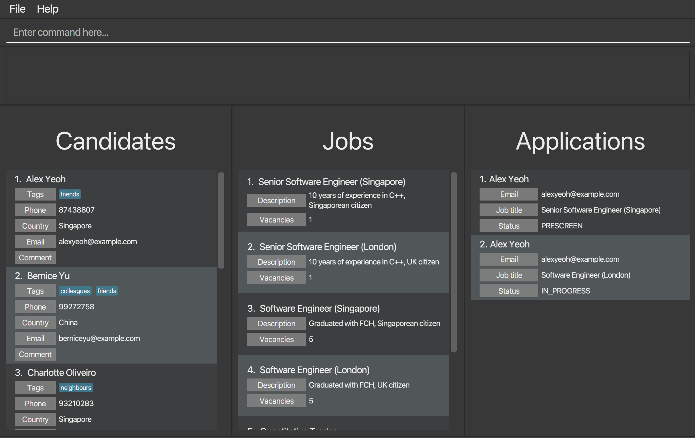

5. Type the command in the command box and press Enter to execute it. e.g. typing **`help`** and pressing Enter will open the help window. 
   Some example commands you can try:

    * `list` : Lists all contacts.

    * `add n/John Doe e/johnd@example.com c/HK p/61234567 t/Internal` : Adds a contact named `John Doe` to the Address Book.

    * `delete 3` : Deletes the 3rd contact shown in the current list.

    * `clear` : Deletes all contacts.

    * `exit` : Exits the app.

6. Refer to the [Features](#features) below for details of each command.

--------------------------------------------------------------------------------------------------------------------

## Features

**:information_source: Notes about the command format:** 

* Words in `UPPER_CASE` are the parameters to be supplied by the user. 
  e.g. in `add n/NAME`, `NAME` is a parameter which can be used as `add n/John Doe`. 

* These are the constraints for each of the parameters (this applies to all commands):

| Parameter       | Prefix | Format                                                                                                                                                                                                                                                                                                                                                                                                                                                                                                                                                                                                                                                                                                                                              |
|-----------------|--------|-----------------------------------------------------------------------------------------------------------------------------------------------------------------------------------------------------------------------------------------------------------------------------------------------------------------------------------------------------------------------------------------------------------------------------------------------------------------------------------------------------------------------------------------------------------------------------------------------------------------------------------------------------------------------------------------------------------------------------------------------------|
| **NAME**        | n/     | Cannot be blank, and only alphanumeric characters and spaces are allowed. In particular, special characters such as `/` and `-` and non-English characters (e.g. Chinese characters) are not allowed. This would be part of the planned improvements.                                                                                                                                                                                                                                                                                                                                                                                                                                                                                               |
| **PHONE**       | p/     | Cannot be blank and must adhere to the following constraints:    1. International phone numbers should contain a country code in front (+ followed by 1 to 3 digits), then a space, followed by a combination of digits, spaces, parentheses or hyphens with at least 3 digits.    2. If country code is omitted, it must be a valid Singapore phone number. It must start with 3, 6, 8 or 9 and must be in the following formats: `XXXXYYYY`, `XXXX-YYYY` or `XXXX YYYY`.   3. Other than the above constraints, there is no other validation to check if a country code is valid. Furthermore, given a country code, there is no phone validation specific to the country code. This would be part of the planned improvements. |
| **EMAIL**       | e/     | Must be of the format local-part@domain and adhere to the following constraints:    1. The local-part should only contain alphanumeric characters and these special characters, excluding the parentheses, (+_.-). The local-part may not start or end with any special characters.    2. This is followed by a '@' and then a domain name. The domain name is made up of domain labels separated by periods. The domain name must:    2a. end with a domain label at least 2 characters long   2b. have each domain label start and end with alphanumeric characters   2c. have each domain label consist of alphanumeric characters, separated only by hyphens, if any.                                                   |
| **COUNTRY**     | c/     | Must be a valid ISO-3166-1 alpha-2 code which can be found from https://www.iso.org/obp/ui/#search/code/. It is case-sensitive and must be in ALL CAPITALS. Alternatively, you can refer to the [appendix](#appendix-country-codes) for the exact ISO code to use for each country. Note that the value for country field shown on the UI is the English display name equivalent of the ISO code for user convenience, and what is actually stored in the backend is the ISO code.                                                                                                                                                                                                                                                                  |
| **TAG**         | t/     | Cannot be blank (except in edit command), and only alphanumeric characters are allowed.                                                                                                                                                                                                                                                                                                                                                                                                                                                                                                                                                                                                                                                             |
| **COMMENT**     | None   | Can be blank and does not have any constraints.                                                                                                                                                                                                                                                                                                                                                                                                                                                                                                                                                                                                                                                                                                     |
| **TITLE**       | ti/    | Cannot be blank and has a character limit of 100.                                                                                                                                                                                                                                                                                                                                                                                                                                                                                                                                                                                                                                                                                                   |
| **DESCRIPTION** | d/     | Can be blank and does not have any constraints.                                                                                                                                                                                                                                                                                                                                                                                                                                                                                                                                                                                                                                                                                                     |
| **VACANCY**     | v/     | Must be a positive integer.                                                                                                                                                                                                                                                                                                                                                                                                                                                                                                                                                                                                                                                                                                                         |
| **STATUS**      | s/     | Must be one of the following 5 statuses (not case-sensitive): PRESCREEN, IN_PROGRESS, WAITLIST, OFFERED, REJECTED                                                                                                                                                                                                                                                                                                                                                                                                                                                                                                                                                                                                                                   |                                                                           |                                                                                                                              |                                                                                                                                         |

* These are the primary key (i.e. no 2 items can have the same parameter) of candidates, jobs and applications respectively:
  * **Candidates**: EMAIL
  * **Jobs**: TITLE
  * **Applications**: (EMAIL, TITLE) - either EMAIL or TITLE can be the same, as long as both are not the same.

* Items in square brackets are optional. 
  e.g `n/NAME [t/TAG]` can be used as `n/John Doe t/friend` or as `n/John Doe`.

* Items with `…`​ after them can be used multiple times including zero times. 
  e.g. `[t/TAG]…​` can be used as ` ` (i.e. 0 times), `t/friend`, `t/friend t/family` etc.

* Parameters can be in any order. 
  e.g. if the command specifies `n/NAME p/PHONE`, `p/PHONE n/NAME` is also acceptable.

* Extraneous parameters for commands that do not take in parameters (such as `help`, `list`, `exit` and `clear`) will be ignored. 
  e.g. if the command specifies `help 123`, it will be interpreted as `help`.

* If you are using a PDF version of this document, be careful when copying and pasting commands that span multiple lines as space characters surrounding line-breaks may be omitted when copied over to the application.

### Viewing help : `help`

Shows a message explaining how to access the help page.

Format: `help`

### Adding a person: `add`

Adds a person to the candidate list.

Format: `add n/NAME e/EMAIL c/COUNTRY p/PHONE [t/TAG]…​`

:bulb: **Tip:**
A person can have any number of tags (including 0)

Examples:
* `add n/John Doe e/johnd@example.com c/HK p/61234567`
* `add n/John Doe e/asdf@gmail.com c/SG p/61234567 t/Internal`

The following is an example of how the `add` command can be run in the GUI.

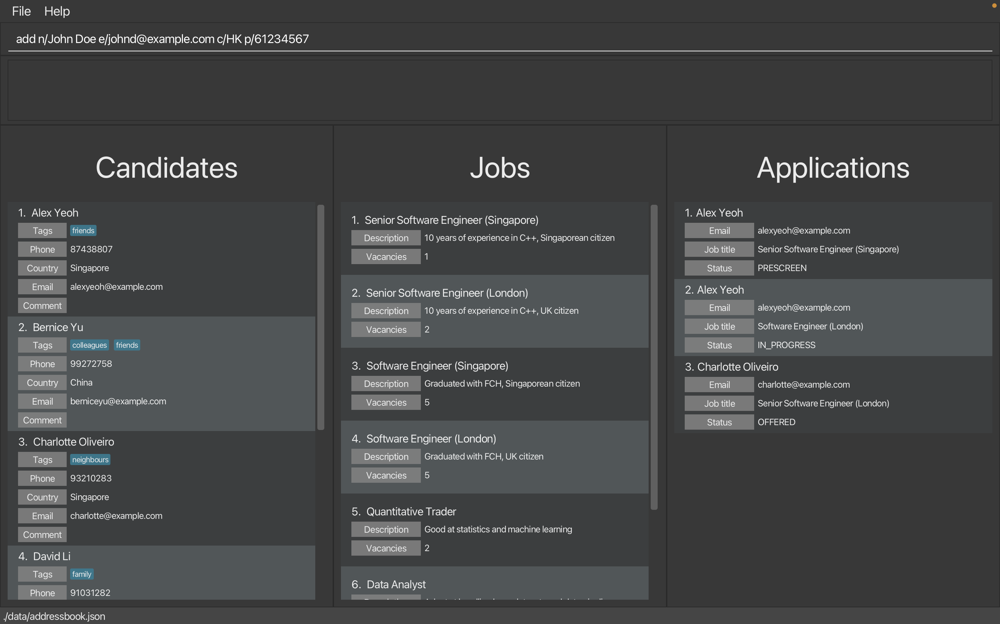

After the application has been successfully added, a success message will be shown in the output box. You can also see your new person in the person list display as seen below.

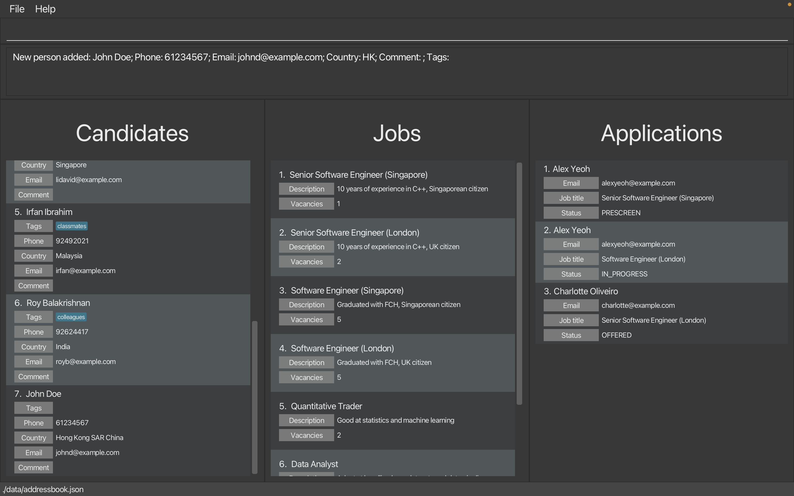

### Adding a job: `add_job`

Adds a job to the job list.

Format: `add_job ti/TITLE [d/DESCRIPTION] v/VACANCY`

Examples:
* `add_job ti/Software Engineer d/Must be proficient in C++ v/10`
* `add_job ti/ML Engineer v/15`

The following is an example of how the `add_job` command can be run in the GUI.

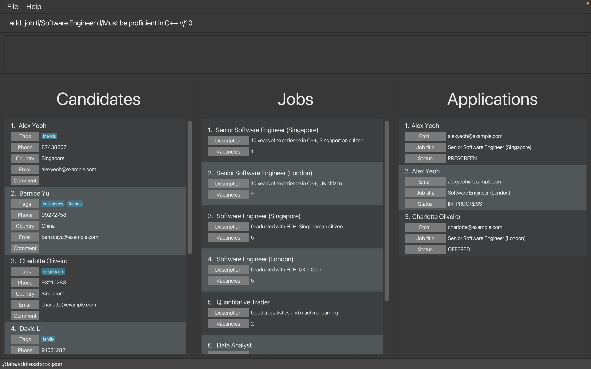

After the application has been successfully added, a success message will be shown in the output box. You can also see your new job in the job list display as seen below

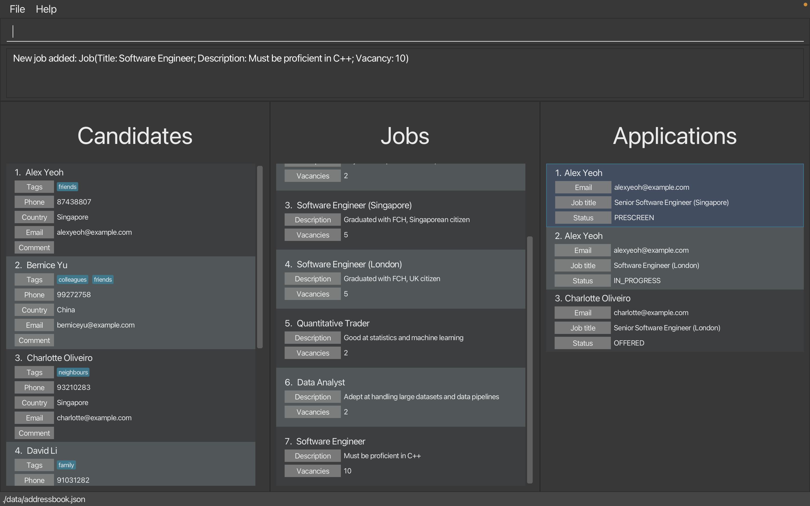

### Adding an application: `add_app`

Adds a job application from a candidate to the application list.

Format: `add_app e/EMAIL ti/TITLE [s/STATUS]`

* The application added will contain the candidate with the specified email and the job with the specified title.
* If `STATUS` is omitted, then the `STATUS` of the application will be `PRESCREEN`.
* There cannot be 2 or more applications with the same pair of candidate and job.
* The addition of an application to a job will fail if any of these conditions are met:
    * The status of the application to be added is `OFFERED`, and the number of `OFFERED` applications to the job is already equal to the number of vacancies of the job.
    * The candidate list does not contain a candidate with the specified email.
    * The job list does not contain a job with the specified job title.

Examples:
* `add_app e/lidavid@example.com ti/Software Engineer (Singapore)`
* `add_app e/berniceyu@example.com ti/Software Engineer (Singapore) s/OFFERED`

The following is an example of how the `add_app` command can be run in the GUI.

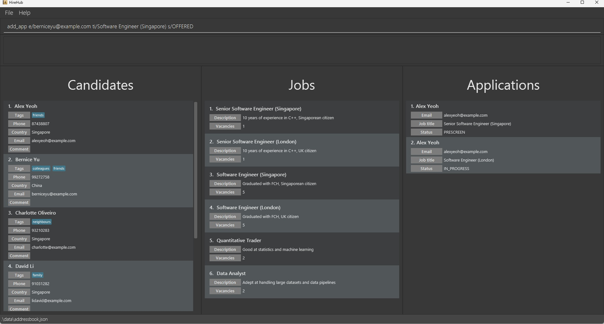

After the application has been successfully added, a success message will be shown in the output box. You can also see your new application in the application list display as seen below.

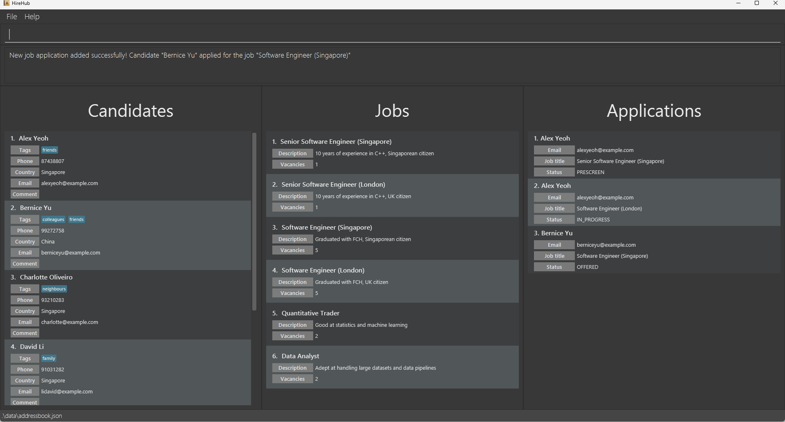

### Edit candidate details: `edit`

Edits an existing candidate in the candidate list.

You can edit any of the valid candidate details including name, email, country and tags at the specified **INDEX**. Here, **INDEX** refers to the index number of candidates shown in the displayed candidate list.

Format: `edit INDEX [n/NAME] [e/EMAIL] [c/COUNTRY] [p/PHONE] [t/TAG]…​`

---

* Even though you can edit multiple candidate details at once, attribute to edit must be **non-empty**. In other words, you must edit **at least one attribute** specified above.
* When **editing tags**, the existing tags of the candidate will be **removed**. Thus, you must specify **every tag** you want to keep on the candidate whenever you edit the candidate details.
* Applications involving the candidate to edit will be updated to involve the edited candidate.
* **Comment and Interview Status** field for the candidates **cannot be edited** by `edit` as there is a dedicated method for editing them separately.

---
Examples:
* `edit 24 n/Johnny Doe e/johnnydoe@gmail.com c/SG`

This command edits **name**, **email**, and **country of residence** of the candidate with index 24 to **Johnny Doe**, **johnnydoe@gmail.com**, and **Singapore**, respectively.

* `edit 8 n/Jeb Song e/jebsong@gmail.com t/IMOGold`

This command edits **name**, **email**, and the tag for **acceptance status** of the candidate with index 8 to **Jeb Song**, **jebsong@gmail.com**, and **IMOGold**, respectively. Note that the existing tag(s) on this candidate (if any) is/are completely removed and a new tag `IMOGold` is added.

---

If edit command is successfully executed, the app will display the edited candidate with the new attributes.

### Edit a job: `edit_job`

Edits an existing job in the job list.

You can edit any of the valid job details including title, description and vacancy at the specified **INDEX**. Here, **INDEX** refers to the index number of job shown in the displayed job list.

Format: `edit_job INDEX [ti/TITLE] [d/DESCRIPTION] [v/VACANCY]`

Example:
* `edit_job 1 ti/Quantitative Trader d/Must have strong statistics background v/3`

---

* Even though you can edit multiple job details at once, attribute to edit must be **non-empty**. In other words, you must edit **at least one attribute** specified above.
* Applications involving the job to edit will be updated to involve the edited job.
* Editing of the vacancy of a job will fail if the edited vacancy is less than the current number of applications to the job with `OFFERED` status.

---
### Adding a comment on a candidate: `comment`

Leaves comments on important points to note down for individual candidates during the recruitment process. This overwrites existing comment (if any) and displays the resulting candidate.

* `INDEX` must be within the range `1` to `n`, where `n` is the number of records in the database.

Format: `comment INDEX COMMENT`

Examples:
* `comment 3 Managed to solve every round 3 interview questions. He must be a strong candidate, potentially to be recruited as a quantitative research intern at Jane Street.`
* `comment 1` deletes the comment from candidate of index 1.

### Tag a candidate: `tag`

Appends the tag or tags to a candidate's list of tags.

You can list any number of tags greater than 0, and all of them will be added to the specified **INDEX**. Here, **INDEX** refers to the index number of candidates shown in the displayed candidate list.

Duplicate tags or already-present tags will not affect the candidate.

Format: `tag INDEX t/TAG [t/TAG]…​`

* At least one tag must be provided.

Examples:
* `tag 24 t/smart` adds the tag "smart" to the candidate with index 24.
* `tag 8 t/ExceptionalWork t/IMOGold t/PhD` adds the tags "ExceptionalWork", "IMOGold" and "PhD" to the candidate with index 8.

If tag command is successfully executed, the app will display the candidate with the new tags.

### Delete tag of a candidate: `delete_tag`

Deletes existing tag(s) from a candidate's list of tags

Format: `delete_tag INDEX t/TAG [t/TAG]…​`

* At least one tag must be provided.
* The specified tag(s) must be in the candidate's list of tags.

Example:
* `delete_tag 1 t/ExceptionalWork t/IMOGold` removes these tags from the 1st candidate displayed.

### Change status of an application: `status`

Changes the interview status of an application.

Interview status must be one of the following: `PRESCREEN`, `IN_PROGRESS`, `WAITLIST`, `OFFERED`, `REJECTED`.
When an application is added, by default it has status `PRESCREEN`.

Format: `status INDEX STATUS`

* The status update to an application of a job will fail under this condition:
    * The status of the application to change to is `OFFERED`, and the number of `OFFERED` applications to the job is already equal to the number of vacancies of the job.

Example:
* `status 24 IN_PROGRESS` changes the status of the application with index 24 to `IN_PROGRESS`.

If status command is successfully executed, the app will display the application with the new status.

The below demonstrates an error from the app when the user attempts to add more candidates with `OFFERED` status than the initial vacancy:

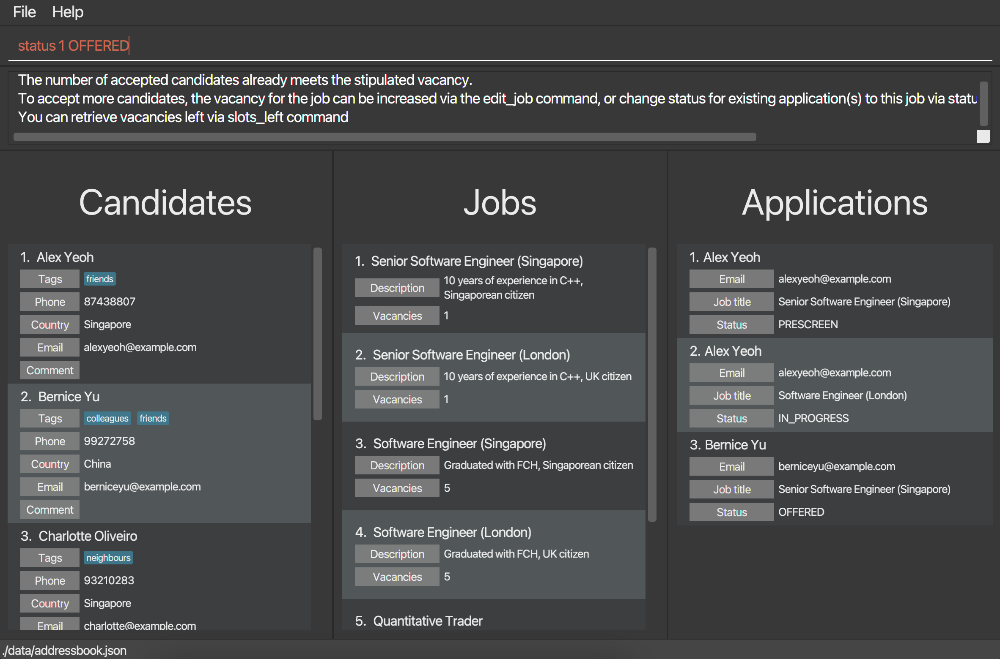

The above example attempts to add more `OFFERED` candidates for the job titled `Senior Software Engineer (Singapore)` with initial vacancy 1 where there is already 1 candidate, "Alex Yeoh", whose status is `OFFERED` for this position.

### Delete a candidate: `delete`

Deletes an existing candidate from the candidate list.

You can delete any candidates in the displayed list at the specified **INDEX**. Here, **INDEX** refers to the index number of candidates shown in the displayed candidate list. The candidate index **must be** within the range from ***1*** to ***n***, where ***n*** represents the **number of candidates** in the database.

Format: `delete INDEX`

---

* If INDEX provided is valid, a confirmation message would be displayed where the user would type **Y/N** to confirm the deletion. If **Y** is selected, it will delete the candidate from the list and display the deleted candidate. If **N** is selected, it will display that the delete operation is cancelled.
* Applications involving the candidate to delete will also be deleted.

---

Example : `delete 1` removes the candidate at first position in the candidate list displayed.

The following is an example of how the `delete` command can be run in the GUI.

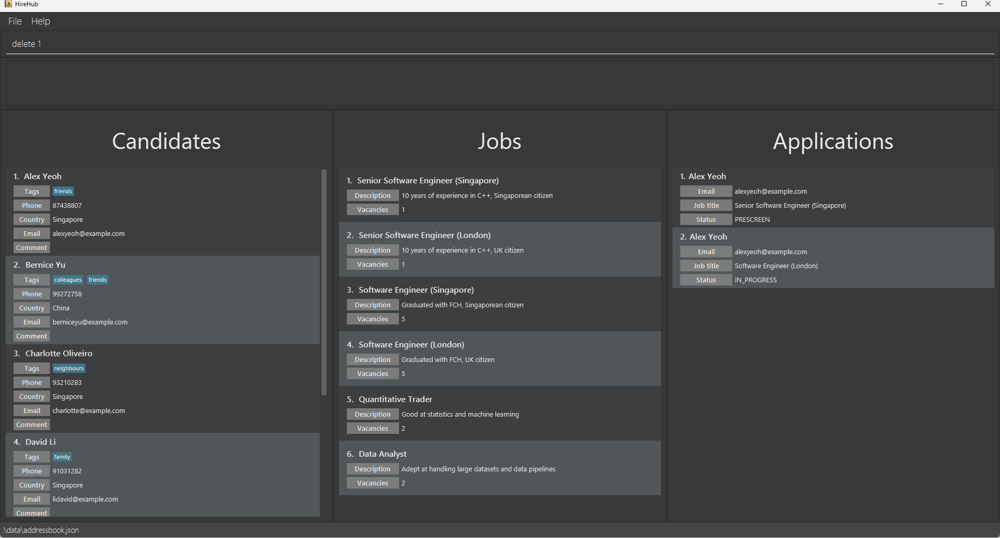

A confirmation message will show up. Type **Y** to confirm the deletion.

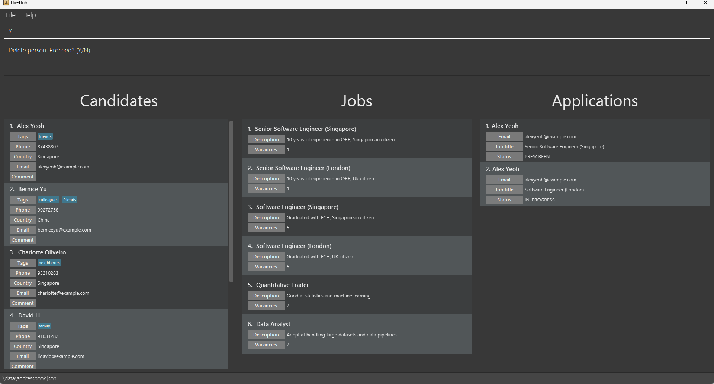

After the person has been successfully added, a success message will be shown in the output box. You can see the person deleted from the person list, and all corresponding applications associated with the deleted person have been removed as well, as seen below.

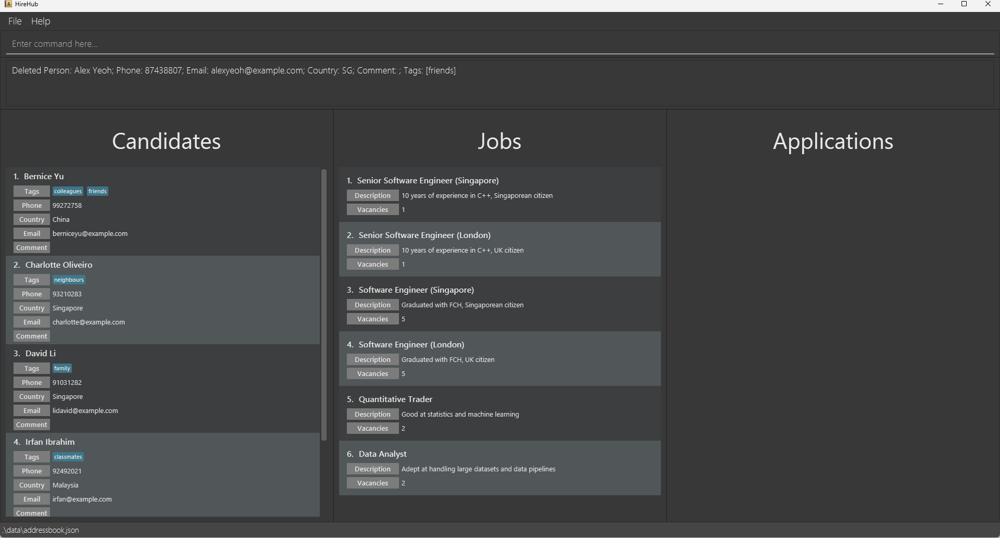

### Delete a job: `delete_job`

Deletes an existing job from the job list.

Format: `delete_job INDEX`

---

* If INDEX provided is valid, a confirmation message would be displayed where the user would type **Y/N** to confirm the deletion. If **Y** is selected, it will delete the job from the list and display the deleted job. If **N** is selected, it will display that the delete operation is cancelled.
* Applications involving the job to delete will also be deleted.

---

Example:
* `delete_job 3` removes the job at third position in the job list displayed.

### Delete an application: `delete_app`

Deletes an existing application from the application list.

Format: `delete_app INDEX`

---

* If INDEX provided is valid, a confirmation message would be displayed where the user would type **Y/N** to confirm the deletion. If **Y** is selected, it will delete the application from the list and display the deleted application. If **N** is selected, it will display that the delete operation is cancelled.

---

Example:
* `delete_app 3` removes the application at third position in the application list displayed.

### Clearing all entries : `clear`

Clears all entries from Hirehub's address book. All applications will be cleared as well.

* A confirmation message would be displayed. Type in **Y** to confirm the deletion.

Format: `clear`

### Search for matching candidates : `search`

Searches candidates whose attributes match the specified attributes in the search criteria.

Format: `search [n/NAME] [e/EMAIL] [c/COUNTRY] [m/COMMENT] [p/PHONE] [t/TAG]`

* At least one of the optional fields must be provided.
* The search is case-sensitive, e.g. `hans` will not match `Hans`.
* For email, country and phone, only full words will be matched.
* For name, comment and tag, partial words will be matched, e.g. `Han` will match `Hans`.
* The search will fail if either of the email, country, phone is in an invalid format.
* If multiple fields are specified, only candidates that match **all** the specified attributes will be returned.

Examples:
* `search n/John c/SG` returns candidates whose names contain `John` and whose country is from `Singapore`.
* `search t/Internal` returns candidates whose tags contain `Internal`.

### Search for matching jobs : `search_job`

Searches jobs whose attributes match the specified attributes in the search criteria.

Format: `search_job [ti/TITLE] [d/DESCRIPTION] [v/VACANCY]`

* At least one of the optional fields must be provided.
* The search is case-sensitive, e.g. `engineer` will not match `Engineer`.
* For title and description, partial words will be matched.
* For vacancy, only jobs with the same number of vacancies will be matched.
* If multiple fields are specified, only jobs that match **all** the specified attributes will be returned.

Examples:
* `search_job ti/Engineer d/C++` returns jobs whose titles contain `Engineer` and whose description contain `C++`.
* `search_job v/10` returns jobs whose number of vacancies is 10.

### Search for matching applications : `search_app`

Searches applications whose attributes match the specified attributes in the search criteria.

Format: `search_app [e/EMAIL] [ti/TITLE] [s/STATUS]`

* At least one of the optional fields must be provided.
* For title, partial words will be matched.
* For email and status, only full words will be matched.
* For email and title, the search is case-sensitive.
* For status, the search is case-insensitive.
* The search will fail if either email or status is in an invalid format.
* If multiple fields are specified, only applications that match **all** the specified attributes will be returned.

Examples:
* `search_app e/alexyeoh@example.com s/PRESCREEN` returns applications from the candidate with email `alexyeoh@example.com` and with status `PRESCREEN`.
* `search_app e/alexyeoh@example.com ti/Engineer` returns the application from candidate with email `alexyeoh@example.com` to the job with title containing `Engineer`.
* `search_app ti/Software Engineer` returns applications to the job with title containing `Software Engineer`.

### Accessing by index: `get`

Accesses candidates by **INDEX**. Here, **INDEX** refers to the index number of candidates shown in the displayed candidate list. The candidate index **must be** within the range from 1 to n, where n represents the **number of candidates** in the database.

Format: `get INDEX`

* `INDEX` must be within the range `1` to `n`, where `n` is the number of candidates currently displayed in the `"Candidates"` column of the app.

Example:
* `get 24` returns the candidate with index 24.

### Finding remaining vacancies: `slots_left`

Finds the remaining vacancies of a job at the specified **INDEX** from the list of jobs displayed in the Hirehub app. The remaining vacancies is the number of vacancies of the job, subtracted by the number of applications to the job with `OFFERED` status.

The remaining vacancies of the job will be displayed in the message box.

Format: `slots_left INDEX`

Example:

Candidate named "Alex Yeoh" has applied for a job titled "Senior Software Engineer (Singapore)" with initial vacancy 1. Currently, Alex Yeoh's application status is `PRESCREEN`.
If the user types in `slots_left 1`, the remaining vacancy displayed for the job is 1 as shows below:

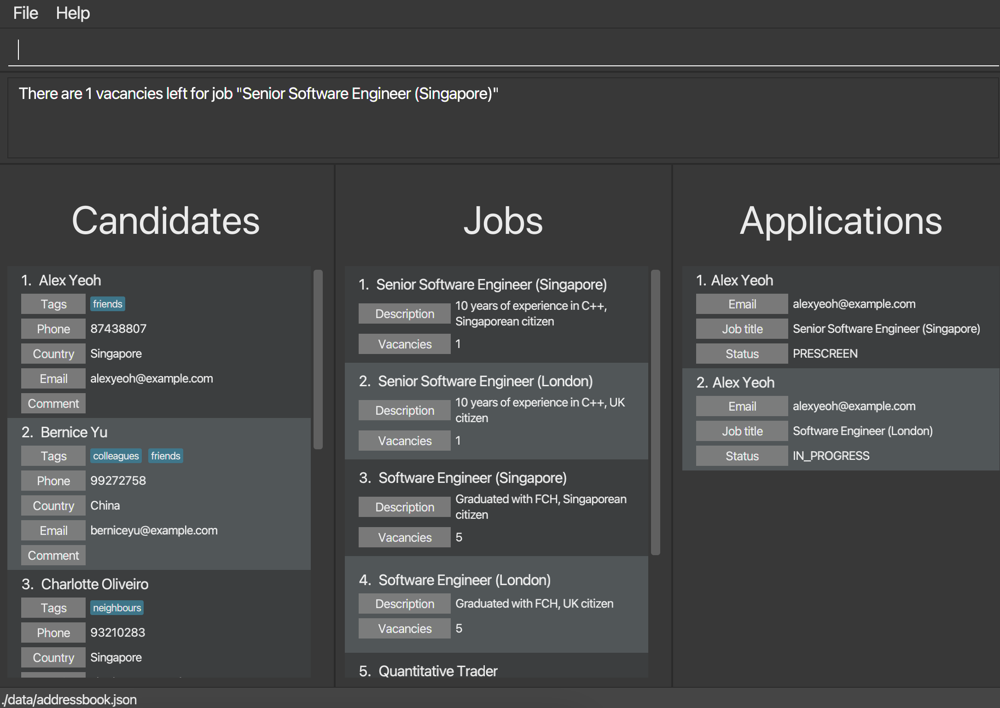

Now, the status of application for candidate "Alex Yeoh" is updated to `OFFERED`. If the user types in `slots_left 1` to find out the remaining vacancy, the output is 0 since Alex Yeoh got an offer for this position:

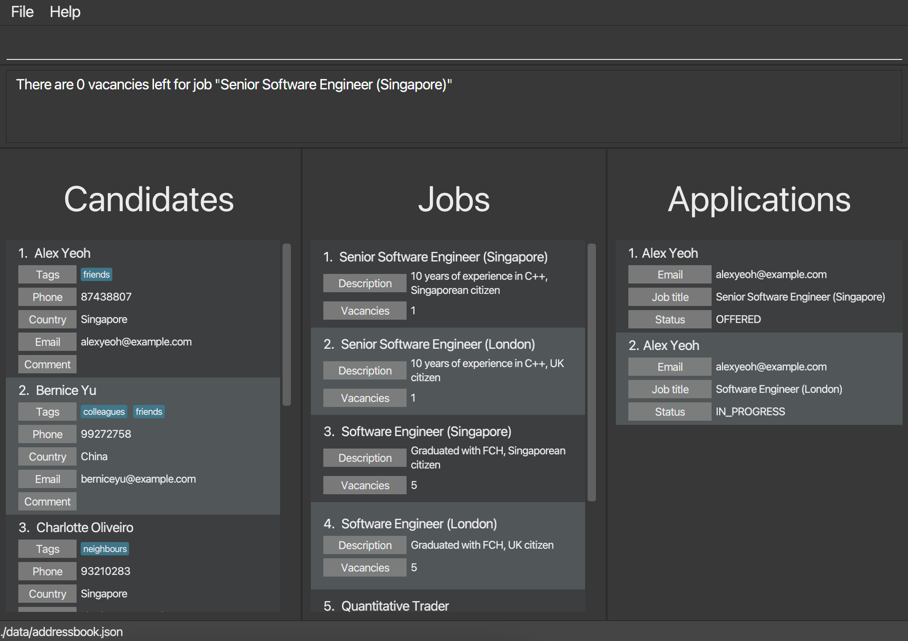

### Listing all persons : `list`

Shows a list of all persons in the address book.

Format: `list`

### Listing all jobs : `list_job`

Shows a list of all jobs in the job list.

Format: `list_job`

### Listing all applications : `list_app`

Shows a list of all applications in the application list.

Format: `list_app`

### Exiting the program : `exit`

Exits the program.

Format: `exit`

### Saving the data

HireHub data are saved in the hard disk automatically after any command that changes the data. There is no need to save manually.

### Editing the data files

HireHub data are saved automatically as JSON files `[JAR file location]/data/hirehub.json`, `[JAR file location]/data/jobs.json` and `[JAR file location]/data/applications.json`. Advanced users are welcome to update data directly by editing those data files.

:exclamation: **Caution:**
If your changes to the data files makes their format invalid, HireHub will discard all data and start with empty data files at the next run. Hence, it is recommended to take a backup of the files before editing them. 
Furthermore, certain edits can cause HireHub to behave in unexpected ways (e.g., if a value entered is outside the acceptable range). Therefore, edit the data files only if you are confident that you can update it correctly.

### Archiving data files `[coming in v2.0]`

_Details coming soon ..._

--------------------------------------------------------------------------------------------------------------------

## FAQ

**Q**: How do I transfer my data to another Computer? 
**A**: Install the app in the other computer and overwrite the empty data files it creates with the files that contain the data of your previous HireHub home folder.

**Q**: What is the difference between `edit` and `tag`? 
**A**: `edit` will overwrite any current tags with new tags, while `tag` will append the new tags to the current ones. For example, suppose that John is candidate 1 with tags `Internal` and `Waitlist`. `edit 1 t/QuantResearcher` will change John's tags to just `QuantResearcher`, while `tag t/QuantResearcher` will change John's tags to `Internal`, `Waitlist` and `QuantResearcher`.

**Q**: Why can't I add/edit a candidate/job respectively?
**A**: Check the email/title of the candidate/job again. After add/edit operation, no 2 candidates can have the same email (not name), and no 2 jobs can have the same title.

--------------------------------------------------------------------------------------------------------------------

## Known issues

1. **When using multiple screens**, if you move the application to a secondary screen, and later switch to using only the primary screen, the GUI will open off-screen. The remedy is to delete the `preferences.json` file created by the application before running the application again.

--------------------------------------------------------------------------------------------------------------------

## Command summary

| Action                  | Format, Examples                                                                                                                                    |
|-------------------------|-----------------------------------------------------------------------------------------------------------------------------------------------------|
| **Add**                 | `add n/NAME e/EMAIL c/COUNTRY p/PHONE [t/TAG]…​`   e.g., `add n/John Doe e/asdf@gmail.com c/SG p/61234567 t/Internal`                            |
| **Add job**             | `add_job ti/TITLE [d/DESCRIPTION] v/VACANCY`   e.g., `add_job ti/Software Engineer d/Must be proficient in C++ v/10`                             |
| **Add application**     | `add_app e/EMAIL ti/TITLE [s/STATUS]`   e.g., `add_app e/john@example.com ti/Software Engineer s/OFFERED`                                        |
| **Clear**               | `clear`                                                                                                                                             |
| **Comment**             | `comment INDEX COMMENT`   e.g., `comment 3 Managed to solve every round 3 interview questions.`                                                  |
| **Delete**              | `delete INDEX`   e.g., `delete 3`                                                                                                                |
| **Delete job**          | `delete_job INDEX`   e.g., `delete_job 3`                                                                                                        |
| **Delete application**  | `delete_app INDEX`   e.g., `delete_app 3`                                                                                                        |
| **Delete tag**          | `delete_tag INDEX t/TAG [t/TAG]…​`   e.g. `delete_tag 1 t/ExceptionalWork t/IMOGold`                                                             |
| **Edit**                | `edit INDEX [n/NAME] [e/EMAIL] [c/COUNTRY] [p/PHONE] [t/TAG]…​`   e.g.,`edit 24 n/Johnny Doe e/johnnydoe@gmail.com c/SG`                         |
| **Edit job**            | `edit_job INDEX [ti/TITLE] [d/DESCRIPTION] [v/VACANCY]`   e.g., `edit_job 1 ti/Quantitative Trader d/Must have strong statistics background v/3` |
| **Get**                 | `get INDEX`   e.g., `get 24`                                                                                                                     |
| **Help**                | `help`                                                                                                                                              |
| **List**                | `list`                                                                                                                                              |
| **List jobs**           | `list_job`                                                                                                                                          |
| **List applications**   | `list_applications`                                                                                                                                 |
| **Search**              | `search [n/NAME] [e/EMAIL] [c/COUNTRY] [m/COMMENT] [p/PHONE] [t/TAG]`   e.g., `search n/John c/SG`                                               |
| **Search jobs**         | `search_job [ti/TITLE] [d/DESCRIPTION] [v/VACANCY]`   e.g., `search_job ti/Engineer d/C++`                                                       |
| **Search applications** | `search_app [e/EMAIL] [ti/TITLE] [s/STATUS]`   e.g., `search_app e/alexyeoh@example.com s/PRESCREEN`                                             |
| **Slots left**          | `slots_left INDEX`   e.g., `slots_left 3`                                                                                                        |
| **Status**              | `status INDEX INTERVIEW_STATUS`   e.g., `status 24 IN_PROGRESS`                                                                                  |
| **Tag**                 | `tag INDEX t/TAG [t/TAG]…`   e.g., `tag 8 t/ExceptionalWork t/IMOGold t/PhD`                                                                    |                                                                                |                                                                                                                              |                                                                                                                                         |

--------------------------------------------------------------------------------------------------------------------

## Appendix: Country codes

This is the list of ISO-3166-1 alpha-2 codes:

| Code | Country Name                           |
|------|----------------------------------------|
| AD   | Andorra                                |
| AE   | United Arab Emirates                   |
| AF   | Afghanistan                            |
| AG   | Antigua & Barbuda                      |
| AI   | Anguilla                               |
| AL   | Albania                                |
| AM   | Armenia                                |
| AO   | Angola                                 |
| AQ   | Antarctica                             |
| AR   | Argentina                              |
| AS   | American Samoa                         |
| AT   | Austria                                |
| AU   | Australia                              |
| AW   | Aruba                                  |
| AX   | Åland Islands                          |
| AZ   | Azerbaijan                             |
| BA   | Bosnia & Herzegovina                   |
| BB   | Barbados                               |
| BD   | Bangladesh                             |
| BE   | Belgium                                |
| BF   | Burkina Faso                           |
| BG   | Bulgaria                               |
| BH   | Bahrain                                |
| BI   | Burundi                                |
| BJ   | Benin                                  |
| BL   | St. Barthélemy                         |
| BM   | Bermuda                                |
| BN   | Brunei                                 |
| BO   | Bolivia                                |
| BQ   | Caribbean Netherlands                  |
| BR   | Brazil                                 |
| BS   | Bahamas                                |
| BT   | Bhutan                                 |
| BV   | Bouvet Island                          |
| BW   | Botswana                               |
| BY   | Belarus                                |
| BZ   | Belize                                 |
| CA   | Canada                                 |
| CC   | Cocos (Keeling) Islands                |
| CD   | Congo - Kinshasa                       |
| CF   | Central African Republic               |
| CG   | Congo - Brazzaville                    |
| CH   | Switzerland                            |
| CI   | Côte d’Ivoire                          |
| CK   | Cook Islands                           |
| CL   | Chile                                  |
| CM   | Cameroon                               |
| CN   | China                                  |
| CO   | Colombia                               |
| CR   | Costa Rica                             |
| CU   | Cuba                                   |
| CV   | Cape Verde                             |
| CW   | Curaçao                                |
| CX   | Christmas Island                       |
| CY   | Cyprus                                 |
| CZ   | Czechia                                |
| DE   | Germany                                |
| DJ   | Djibouti                               |
| DK   | Denmark                                |
| DM   | Dominica                               |
| DO   | Dominican Republic                     |
| DZ   | Algeria                                |
| EC   | Ecuador                                |
| EE   | Estonia                                |
| EG   | Egypt                                  |
| EH   | Western Sahara                         |
| ER   | Eritrea                                |
| ES   | Spain                                  |
| ET   | Ethiopia                               |
| FI   | Finland                                |
| FJ   | Fiji                                   |
| FK   | Falkland Islands                       |
| FM   | Micronesia                             |
| FO   | Faroe Islands                          |
| FR   | France                                 |
| GA   | Gabon                                  |
| GB   | United Kingdom                         |
| GD   | Grenada                                |
| GE   | Georgia                                |
| GF   | French Guiana                          |
| GG   | Guernsey                               |
| GH   | Ghana                                  |
| GI   | Gibraltar                              |
| GL   | Greenland                              |
| GM   | Gambia                                 |
| GN   | Guinea                                 |
| GP   | Guadeloupe                             |
| GQ   | Equatorial Guinea                      |
| GR   | Greece                                 |
| GS   | South Georgia & South Sandwich Islands |
| GT   | Guatemala                              |
| GU   | Guam                                   |
| GW   | Guinea-Bissau                          |
| GY   | Guyana                                 |
| HK   | Hong Kong SAR China                    |
| HM   | Heard & McDonald Islands               |
| HN   | Honduras                               |
| HR   | Croatia                                |
| HT   | Haiti                                  |
| HU   | Hungary                                |
| ID   | Indonesia                              |
| IE   | Ireland                                |
| IL   | Israel                                 |
| IM   | Isle of Man                            |
| IN   | India                                  |
| IO   | British Indian Ocean Territory         |
| IQ   | Iraq                                   |
| IR   | Iran                                   |
| IS   | Iceland                                |
| IT   | Italy                                  |
| JE   | Jersey                                 |
| JM   | Jamaica                                |
| JO   | Jordan                                 |
| JP   | Japan                                  |
| KE   | Kenya                                  |
| KG   | Kyrgyzstan                             |
| KH   | Cambodia                               |
| KI   | Kiribati                               |
| KM   | Comoros                                |
| KN   | St. Kitts & Nevis                      |
| KP   | North Korea                            |
| KR   | South Korea                            |
| KW   | Kuwait                                 |
| KY   | Cayman Islands                         |
| KZ   | Kazakhstan                             |
| LA   | Laos                                   |
| LB   | Lebanon                                |
| LC   | St. Lucia                              |
| LI   | Liechtenstein                          |
| LK   | Sri Lanka                              |
| LR   | Liberia                                |
| LS   | Lesotho                                |
| LT   | Lithuania                              |
| LU   | Luxembourg                             |
| LV   | Latvia                                 |
| LY   | Libya                                  |
| MA   | Morocco                                |
| MC   | Monaco                                 |
| MD   | Moldova                                |
| ME   | Montenegro                             |
| MF   | St. Martin                             |
| MG   | Madagascar                             |
| MH   | Marshall Islands                       |
| MK   | Macedonia                              |
| ML   | Mali                                   |
| MM   | Myanmar (Burma)                        |
| MN   | Mongolia                               |
| MO   | Macau SAR China                        |
| MP   | Northern Mariana Islands               |
| MQ   | Martinique                             |
| MR   | Mauritania                             |
| MS   | Montserrat                             |
| MT   | Malta                                  |
| MU   | Mauritius                              |
| MV   | Maldives                               |
| MW   | Malawi                                 |
| MX   | Mexico                                 |
| MY   | Malaysia                               |
| MZ   | Mozambique                             |
| NA   | Namibia                                |
| NC   | New Caledonia                          |
| NE   | Niger                                  |
| NF   | Norfolk Island                         |
| NG   | Nigeria                                |
| NI   | Nicaragua                              |
| NL   | Netherlands                            |
| NO   | Norway                                 |
| NP   | Nepal                                  |
| NR   | Nauru                                  |
| NU   | Niue                                   |
| NZ   | New Zealand                            |
| OM   | Oman                                   |
| PA   | Panama                                 |
| PE   | Peru                                   |
| PF   | French Polynesia                       |
| PG   | Papua New Guinea                       |
| PH   | Philippines                            |
| PK   | Pakistan                               |
| PL   | Poland                                 |
| PM   | St. Pierre & Miquelon                  |
| PN   | Pitcairn Islands                       |
| PR   | Puerto Rico                            |
| PS   | Palestinian Territories                |
| PT   | Portugal                               |
| PW   | Palau                                  |
| PY   | Paraguay                               |
| QA   | Qatar                                  |
| RE   | Réunion                                |
| RO   | Romania                                |
| RS   | Serbia                                 |
| RU   | Russia                                 |
| RW   | Rwanda                                 |
| SA   | Saudi Arabia                           |
| SB   | Solomon Islands                        |
| SC   | Seychelles                             |
| SD   | Sudan                                  |
| SE   | Sweden                                 |
| SG   | Singapore                              |
| SH   | St. Helena                             |
| SI   | Slovenia                               |
| SJ   | Svalbard & Jan Mayen                   |
| SK   | Slovakia                               |
| SL   | Sierra Leone                           |
| SM   | San Marino                             |
| SN   | Senegal                                |
| SO   | Somalia                                |
| SR   | Suriname                               |
| SS   | South Sudan                            |
| ST   | São Tomé & Príncipe                    |
| SV   | El Salvador                            |
| SX   | Sint Maarten                           |
| SY   | Syria                                  |
| SZ   | Swaziland                              |
| TC   | Turks & Caicos Islands                 |
| TD   | Chad                                   |
| TF   | French Southern Territories            |
| TG   | Togo                                   |
| TH   | Thailand                               |
| TJ   | Tajikistan                             |
| TK   | Tokelau                                |
| TL   | Timor-Leste                            |
| TM   | Turkmenistan                           |
| TN   | Tunisia                                |
| TO   | Tonga                                  |
| TR   | Turkey                                 |
| TT   | Trinidad & Tobago                      |
| TV   | Tuvalu                                 |
| TW   | Taiwan                                 |
| TZ   | Tanzania                               |
| UA   | Ukraine                                |
| UG   | Uganda                                 |
| UM   | U.S. Outlying Islands                  |
| US   | United States                          |
| UY   | Uruguay                                |
| UZ   | Uzbekistan                             |
| VA   | Vatican City                           |
| VC   | St. Vincent & Grenadines               |
| VE   | Venezuela                              |
| VG   | British Virgin Islands                 |
| VI   | U.S. Virgin Islands                    |
| VN   | Vietnam                                |
| VU   | Vanuatu                                |
| WF   | Wallis & Futuna                        |
| WS   | Samoa                                  |
| YE   | Yemen                                  |
| YT   | Mayotte                                |
| ZA   | South Africa                           |
| ZM   | Zambia                                 |
| ZW   | Zimbabwe                               |

---
